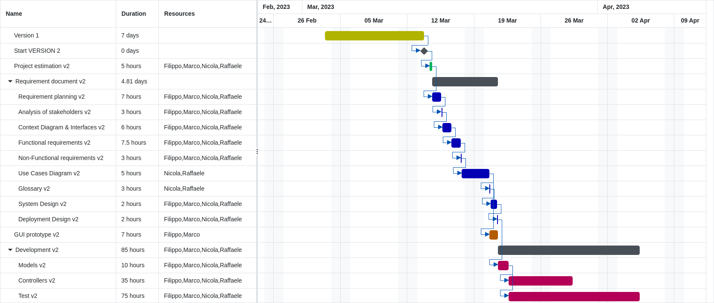

# Project Estimation - FUTURE
Date: 28/04/2023

Version: 2.0

# Estimation approach
Consider the EZWallet  project in FUTURE version (as proposed by the team), assume that you are going to develop the project INDEPENDENT of the deadlines of the course.

# Estimate by size

|             | Estimate                        |             
| ----------- | ------------------------------- |  
| NC =  Estimated number of classes to be developed   |               8               |             
|  A = Estimated average size per class, in LOC       |            300                | 
| S = Estimated size of project, in LOC (= NC * A) | 2400 |
| E = Estimated effort, in person hours (here use productivity 10 LOC per person hour)  |          240                            |   
| C = Estimated cost, in euro (here use 1 person hour cost = 30 euro) | 7200  | 
| Estimated calendar time, in calendar weeks (Assume team of 4 people, 8 hours per day, 5 days per week ) |         1.5           |               

# Estimate by product decomposition
### 
|         component name    | Estimated effort (person hours)   |             
| ----------- | ------------------------------- | 
|requirement document    | 60 |
| GUI prototype | 25 |
|design document | 30 |
| code | 240 |
| unit tests | 150 |
| api tests | 150 |
| management documents  | 12 |

# Estimate by activity decomposition

|         Activity name    | Estimated effort (person hours)   |             
| ----------- | ------------------------------- | 
| **Project estimation** |  |
| Estimation document | 20 |
| **Requirement document** | |
| Requirement planing | 25 |
| Analysis of stakeholders | 10 |
| Context Diagram & interfaces | 6 |
| Definition of project Requirements | 40 |
| --*Functional Requiements* | 30 |
| --*Non-Functional Requirements* | 10 |
| Use Cases Diagram | 20 |
| Glossary | 10 |
| System Design | 8 |
| Deployment Design | 8 |
| **GUI Prototype** | 25 |
| **Design** | |
| Design Document | 30 |
| **Development** | |
| Models | 40 |
| Controllers | 200 |    
| Test | 300 |

# Gantt

# Summary

Report here the results of the three estimation approaches. While the estimate by size is considering just the size and effort related to the code associated with the classes, estimate by product decomposition and estimate by activity decompositon have a global view of the project, taking in consideration also the documents. 

|             | Estimated effort                        |   Estimated duration |          
| ----------- | ------------------------------- | ---------------|
| estimate by size | 240 ph | 1.5 weeks |
| estimate by product decomposition | 667 ph | 4.17 weeks  |
| estimate by activity decomposition | 742 ph | 4.638 weeks  |

