# Graphical User Interface Prototype  - CURRENT

Authors: Gerbaudo Filippo - Vitale Marco

Date: 27/04/2023

Version: 1

For the first version of the GUI we decided to work separately, developing two different design. 

* Proposal 1

  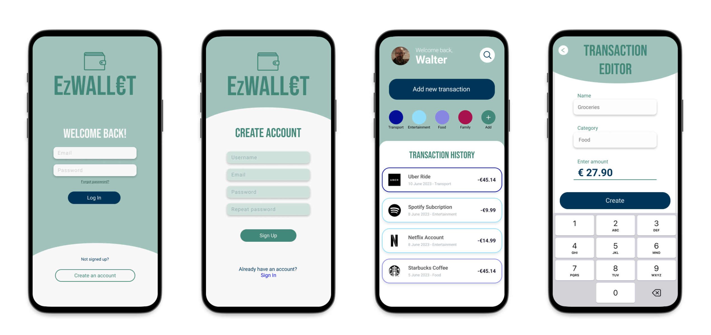

* Proposal 2 

  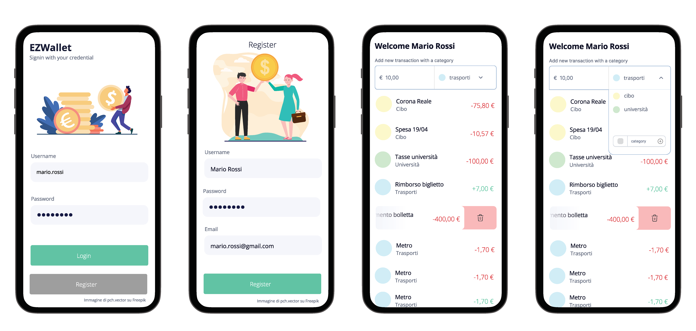

At the end of the work, we created a google form in which we asked at our friends (age range 20-30 / both male-female / different study backgrounds) which of the two options they appreciate the most and why.

These were the results:

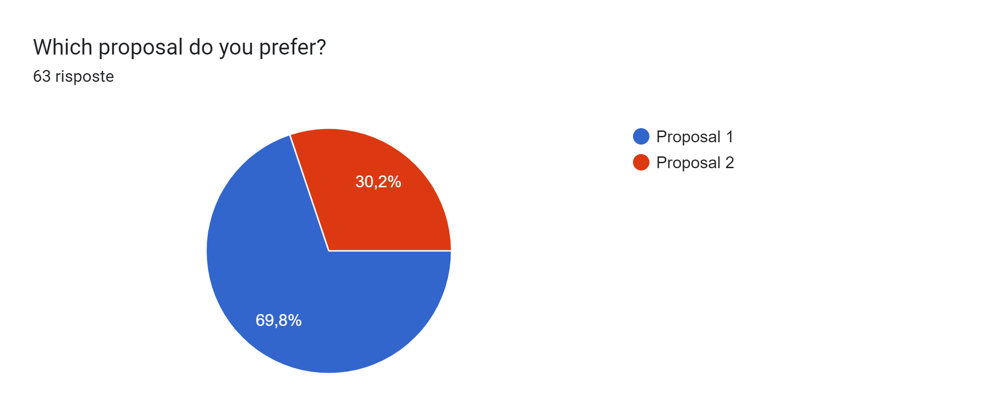

Here some interesting comment:

Person 1 (Choose Proposal 1)
- I consider the first interface way more attractive given the amount of colour it used, which are appealing and do not confuse the whole dashboard purpose. However, I would further implement in how the expenses are marked in the second interface, as in the first one the color categorisation is, imo, too thin and difficult to identify at first glance

Person 2 (Choose Proposal 2)
 - La seconda proposta risulta essere più in linea con altre piattaforme che già ultizzo e sembra essere anche più diretta, chiara e dall'aspetto pulito oltre a darmi idea di una facilità di utilizzo non indifferente. 

 Person 3 (Choose Proposal 1)
- La GUI mi sembra più moderna e minimale. Le funzionalità sono ben suddivise nelle varie schermate e non ammassate tutte in una sola il che rende a prima vista la UX migliore. Inoltre, la riproposizione nelle varie schermate del colore del logo da un tocco di colore e rende meno banale le varie pagine rispetto alla seconda versione

Person 4 (Choose Proposal 2)
- La seconda proposta risulta essere più in linea con altre piattaforme che già ultizzo e sembra essere anche più diretta, chiara e dall'aspetto pulito oltre a darmi idea di una facilità di utilizzo non indifferente. 

The google form results can be found clicking [here](https://docs.google.com/spreadsheets/d/1eFOlonG55_AxSa58q5wAGJswayenCv7Xmp98NJkCSqY/edit?usp=sharing)

## Final GUI proposal

Given the results of the form, we made some adjustments at the design, finally the GUI chosen to represent the first version of EzWallet would be the following:

## Mobile
*	Login 

	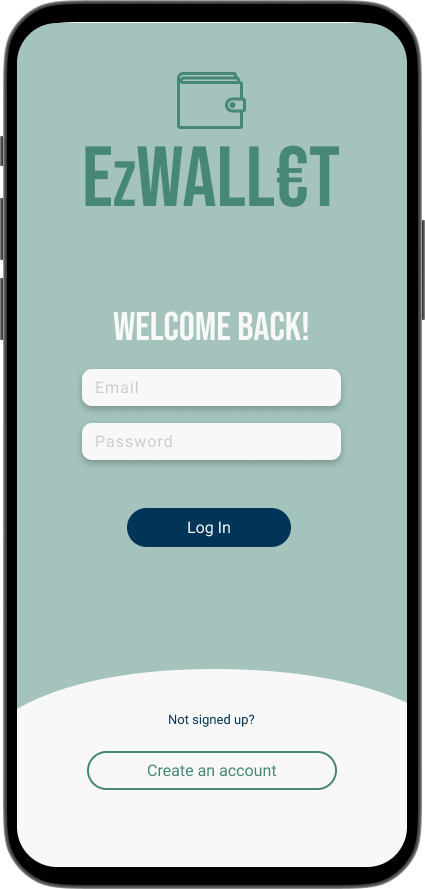

*	Register
	
	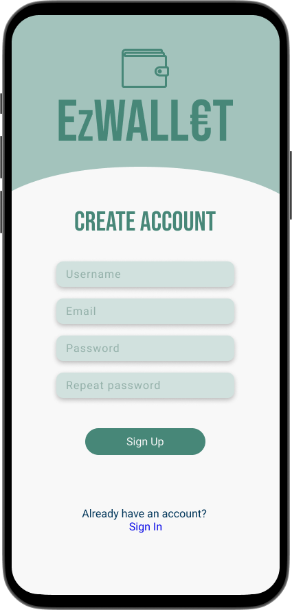

*	Home

	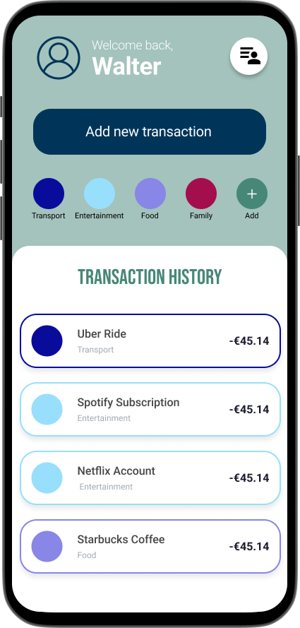
	
*	Transaction editor

	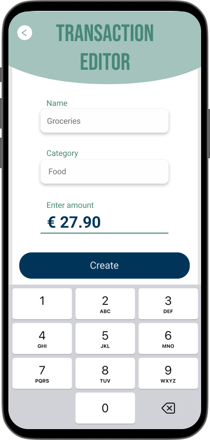
	
*	Users
	
	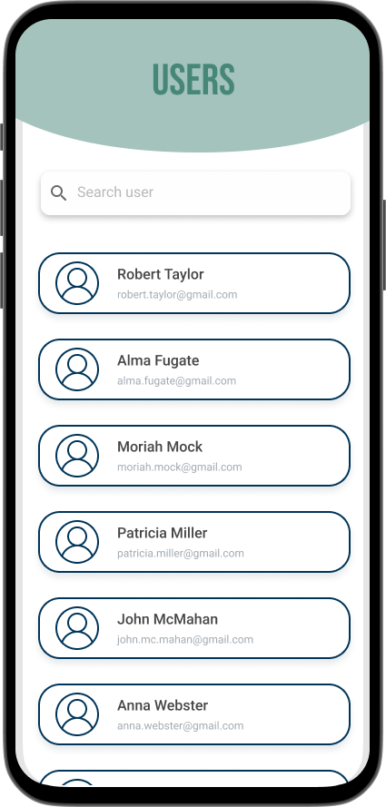

## Desktop

*	Login 

	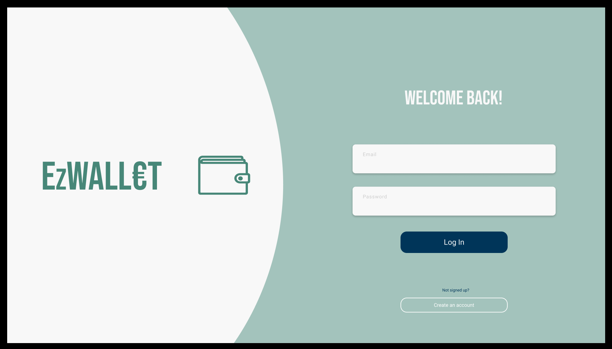

*	Register
	
	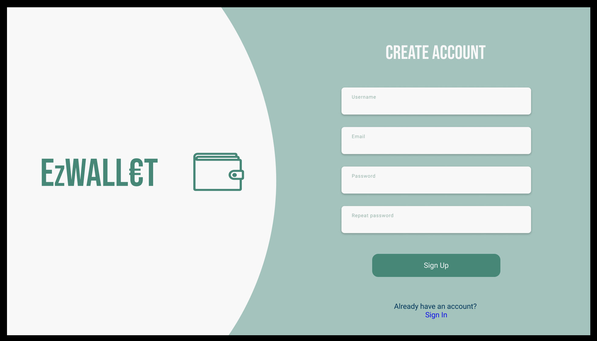

*	Home

	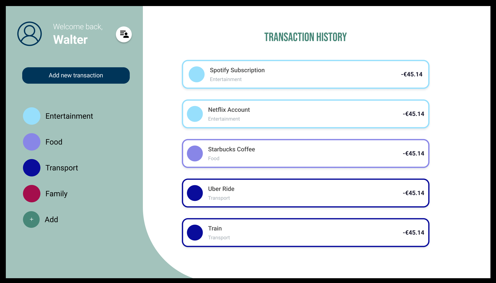
	
*	Transaction editor

	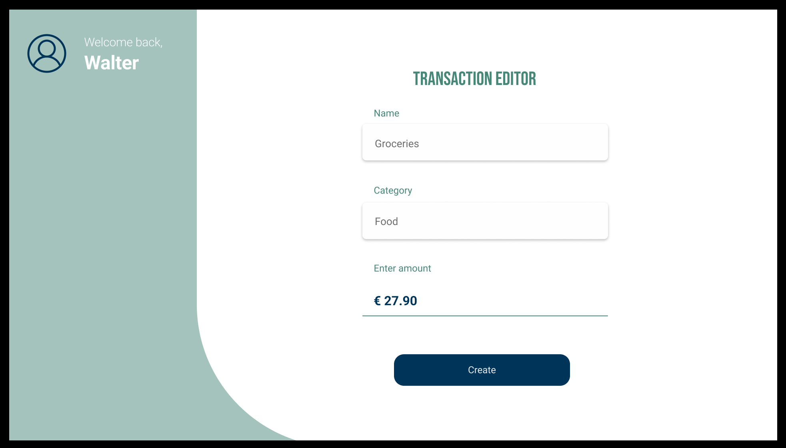
	
*	Users
	
	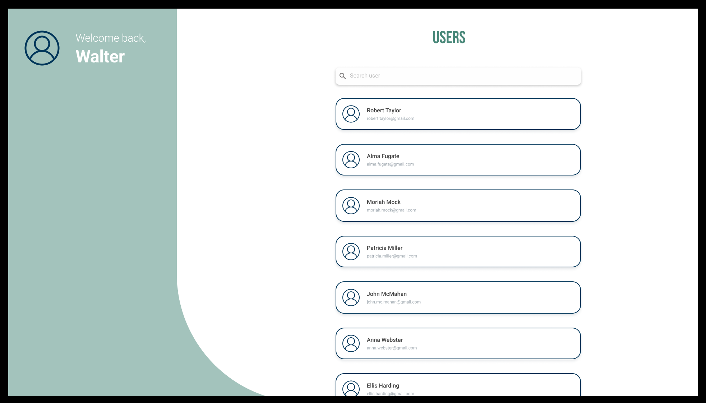

