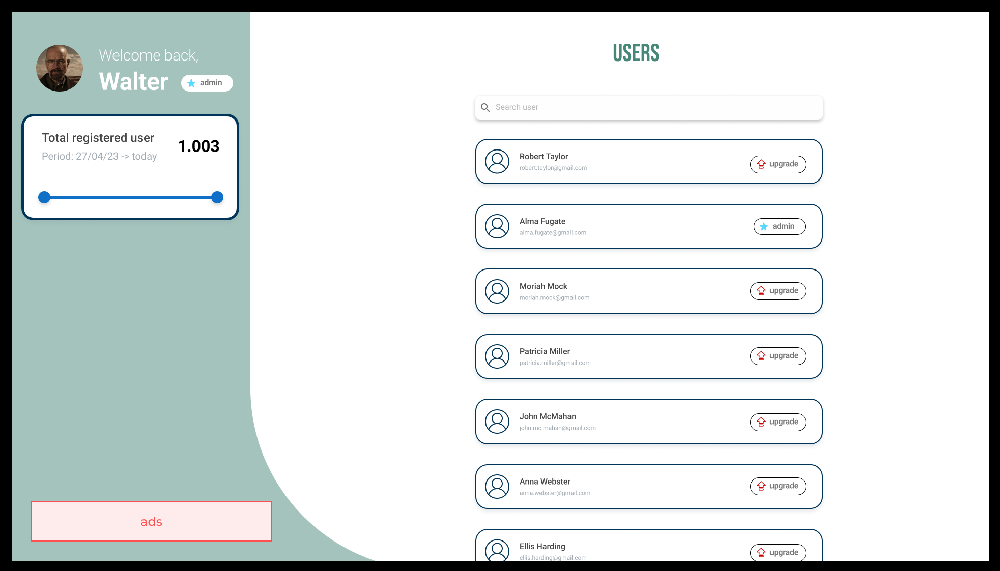

# Graphical User Interface Prototype  - FUTURE

Authors:  Gerbaudo Filippo - Vitale Marco

Date: 27/04/2023

Version: 2.0

Starting from the V1 design, we further developed the GUI to add some functionalities.

According to the NFR2 (portability) the application is presented in two screen size: one desktop and one mobile. 

## Mobile version

* Login page

	
	
* Register page

	
	
* Homepage

	

* Homepage with wallet dropdown open

	

* Transaction editor 

	

* Stats

	

## Desktop version

* Login page

	
	
* Register page

	
	
* Homepage

	

* Transaction editor 

	

* Stats

	

## Desktop - admin side

* Login page (unchanged)

	
	
* Register page (images/V2/unchanged)

	
	
* Homepage

	

* Transaction editor 

	

* Stats

	

* Users list

	

