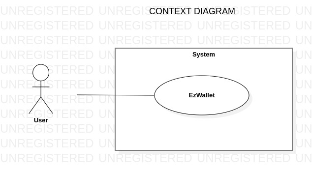
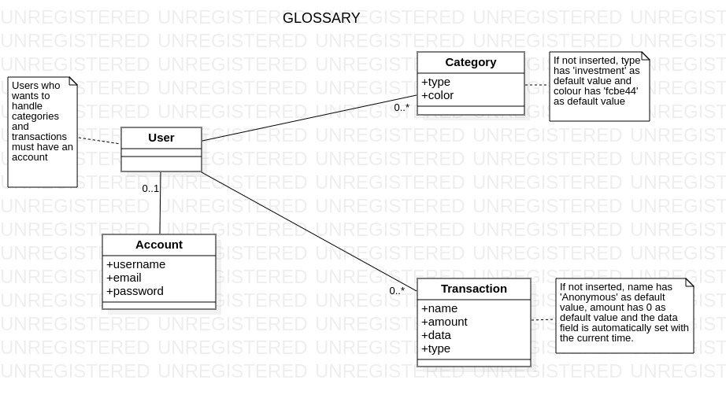
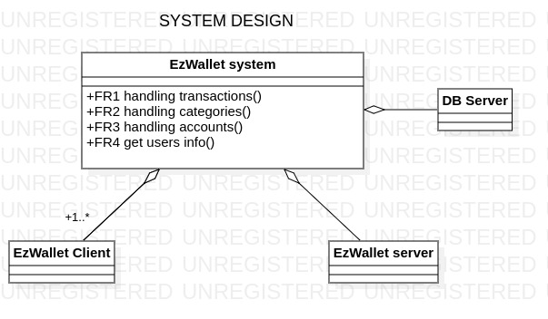
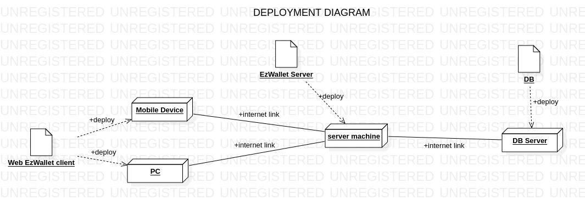

# Requirements Document - current EZWallet

Date: 28/04/2023

Version: V1 - description of EZWallet in CURRENT form (as received by teachers)

 
| Version number | Change |
| ----------------- |:-----------|
| 1.0 | - | 

# Contents

- [Informal description](#informal-description)
- [Stakeholders](#stakeholders)
- [Context Diagram and interfaces](#context-diagram-and-interfaces)
	+ [Context Diagram](#context-diagram)
	+ [Interfaces](#interfaces) 
	
- [Stories and personas](#stories-and-personas)
- [Functional and non functional requirements](#functional-and-non-functional-requirements)
	+ [Functional Requirements](#functional-requirements)
	+ [Non functional requirements](#non-functional-requirements)
- [Use case diagram and use cases](#use-case-diagram-and-use-cases)
	+ [Use case diagram](#use-case-diagram)
	+ [Use cases](#use-cases)
    	+ [Relevant scenarios](#relevant-scenarios)
- [Glossary](#glossary)
- [System design](#system-design)
- [Deployment diagram](#deployment-diagram)

# Informal description
EZWallet (read EaSy Wallet) is a software application designed to help individuals and families keep track of their expenses. Users can enter and categorize their expenses, allowing them to quickly see where their money is going. EZWallet is a powerful tool for those looking to take control of their finances and make informed decisions about their spending.

# Stakeholders
| Stakeholder name  | Description | 
| ----------------- |:-----------:|
|   User       |   The final user that use the application for manage his own expenses       | 
|Competitors (Tricount, Money Manage)|Competitor mobile apps for expenses management|

# Context Diagram and interfaces

## Context Diagram

## Interfaces

| Actor | Logical Interface | Physical Interface  |
| ------------- |:-------------:| :-----:|
|   End User    | Web GUI v1 (key functions) | Generic device (PC or Smartphone) |

# Stories and personas

-	Persona 1: middle-level income, 35-55 year old, with children
	-	He/she wants to keep track of the expenses related to the children separately from the other expenses categories 
-	Persona 2: low-level income, student, 19-25 year old
	-	Keep track of expenses during his/her study period, divided in categories in particular to track transport expenses for a university refund. 
-	Persona 3: middle-level income, 25-55 year old
	-	He is seeking for an easy way to keep track of the expeses during working trips in order to clearly report it to his company for the refund. 
-	Persona 4: high-level income, 25-55 year old
	-	He/she wants to keep track of the expenses during his/her trips to compare the amount of money spent in each one. He/She wants to assigne a category to each trip. 

# Functional and non functional requirements

## Functional Requirements

| ID        | Description  |
| ------------- |:-------------:|
|  **FR1**     | **Handling transactions** |
|  FR1.1    | Create transaction |
|  FR1.2    | Get all transactions |
|  FR1.3    | Delete transaction |
|  FR1.4     | Get the transactions with labels |
|  **FR2**     | **Handling categories** |
|  FR2.1    | Create category |
|  FR2.2    | Get all categories |
|  **FR3**     | **Handling accounts** |
|  FR3.1    | Register |
|  FR3.2    | Login | 
|  FR3.3    | Logout |
|  FR3.4    | Authorization |
|  **FR4**     | **Get users' info** |
|  FR4.1    | Get all users |
|  FR4.2    | Get user by name |

## Non Functional Requirements

| ID        | Type (efficiency, reliability, ..)           | Description  | Refers to |
| ------------- |:-------------:| :-----:| -----:|
|  NFR1     | Usability  | Any person with a basic knowledge about technology should be able to handle core functions in one day |FR1, FR2, FR3, FR4 |
|  NFR2     | Portability | The transition to a future mobile app must be a low-effort operation (not more than 160ph) | all |
| NFR3 | Reliability | Max downtime is of 1 hour at month |all | 
| Domain1 | - | Euro | - | 

# Use case diagram and use cases

## Use case diagram

### UC1: Insert Category

| Actors Involved        | User |
| ------------- |:-------------:| 
|  Precondition     | - |
|  Post condition     | - |
|  Nominal Scenario     | 1.1 |
|  Variants     | - |
|  Exceptions     | 1.2, 1.3 |

| Scenario 1.1 | |
| ------------- |:-------------| 
|  Precondition     | User has an account and he/she has been authorized and authenticated |
|  Post condition     | User has created a new category in his wallet |
| **Step#**        | **Description**  |
|  1     | User selects new category insert functionality|
|  2     | User inserts type and color of the new category |
|  3    | system saves new category into the wallet |

| Scenario 1.2 | |
| ------------- |:-------------| 
|  Precondition     | - |
|  Post condition     | The action is not performed by the system |
| **Step#**        | **Description**  |
|  1     | User tries to do an action|
|  2     | System checks user's authorization rights |
|  3    | System blocks the access for the unauthorized user |

| Scenario 1.3 | |
| ------------- |:-------------| 
|  Precondition     | - |
|  Post condition     | The informations are not stored|
| **Step#**        | **Description**  |
|  1     | User tries to insert category/transaction|
|  2     | System tries to store the informations |
|  3    | System fails|
|  4   | System shows an error message |

### UC2: Retrieve categories

| Actors Involved        | User |
| ------------- |:-------------:| 
|  Precondition     | -|
|  Post condition     | - |
|  Nominal Scenario     | 2.1 |
|  Variants     | - |
|  Exceptions     | 1.2 |

| Scenario 2.1 | User has an account and he/she has been authorized and authenticated |
| ------------- |:-------------| 
|  Precondition     | -|
|  Post condition     | User retrieves the list of categories |
| **Step#**        | **Description**  |
|  1     | User asks for the list of categories |
|  2     | System provides the list of categories |

### UC3: Registration

| Actors Involved        | User |
| ------------- |:-------------:| 
|  Precondition     | - |
|  Post condition     | - |
|  Nominal Scenario     | 3.1 |
|  Variants     | - |
|  Exceptions     | 3.2 |

| Scenario 3.1 | - |
| ------------- |:-------------| 
|  Precondition     |  User has not an account |
|  Post condition     | - |
| **Step#**        | **Description**  |
|  1     | User asks the system to be registered |
|  2     | User inserts his data |
|  3     | User sends his data to the system |
|  4     | System checks if the user already exists |
|  5     | System inserts the new user |

| Scenario 3.2 | |
| ------------- |:-------------| 
|  Precondition     | User is already registered |
|  Post condition     | - |
| **Step#**        | **Description**  |
|  1     | User asks the system to be registered |
|  2     | User inserts his data |
|  3     | User sends his data to the system |
|  4     | System checks if the user already exists |
|  5     | System notifies the user that his data already exists |

### UC4: Login

| Actors Involved        | User |
| ------------- |:-------------:| 
|  Precondition     | - |
|  Post condition     | - |
|  Nominal Scenario     | 4.1 |
|  Variants     | - |
|  Exceptions     | 4.2, 4.3|

| Scenario 4.1 | |
| ------------- |:-------------| 
|  Precondition     | User is already registered |
|  Post condition     | - |
| **Step#**        | **Description**  |
|  1     | User asks the system to log in |
|  2     | User inserts his credentials |
|  3     | User sends his credentials to the system |
|  4     | System checks if the credentials are correct |
|  5     | System gives the access to the user |

| Scenario 4.2 | |
| ------------- |:-------------| 
|  Precondition     | User is not yet registered |
|  Post condition     | - |
| **Step#**        | **Description**  |
|  1     | User asks the system to log in |
|  2     | User inserts his credentials |
|  3     | User sends his credentials to the system |
|  4     | System checks if the credentials are correct |
|  5     | System notifies the user that his data doesn't exist |

| Scenario 4.3 | |
| ------------- |:-------------| 
|  Precondition     | User is already registered |
|  Post condition     | - |
| **Step#**        | **Description**  |
|  1     | User asks the system to log in |
|  2     | User inserts his credentials |
|  3     | User sends his credentials to the system |
|  4     | System checks if the credentials are correct |
|  5     | System notifies the user that the credentials are not correct |

### UC5: Logout

| Actors Involved        | User |
| ------------- |:-------------:| 
|  Precondition     | User is logged in |
|  Post condition     | - |
|  Nominal Scenario     | 5.1 |
|  Variants     | - |
|  Exceptions     | - |

| Scenario 5.1 | |
| ------------- |:-------------| 
|  Precondition     | User is not yet registered |
|  Post condition     | - |
| **Step#**        | **Description**  |
|  1     | User asks the system to logout |
|  2     | System removes the access from the current logged user |

### UC6: Retrieve the list of users

| Actors Involved        | User |
| ------------- |:-------------:| 
|  Precondition     | - |
|  Post condition     | - |
|  Nominal Scenario     | 6.1 |
|  Variants     | - |
|  Exceptions     | - |

| Scenario 6.1 | |
| ------------- |:-------------| 
|  Precondition     | - |
|  Post condition     | - |
| **Step#**        | **Description**  |
|  1     | User asks the system the list of users |
|  2     | System returns the list of users|

### UC7: Retrieve the data of a user

| Actors Involved        | User |
| ------------- |:-------------:| 
|  Precondition     | - |
|  Post condition     | - |
|  Nominal Scenario     | 7.1 |
|  Variants     | - |
|  Exceptions     | 7.2, 7.3, 7.4 |

| Scenario 7.1 | |
| ------------- |:-------------| 
|  Precondition     | User exists and requests for his own data |
|  Post condition     | - |
| **Step#**        | **Description**  |
|  1     | User asks the system for user's data |
|  2     | System checks if the user has the authorization |
|  3     | System checks if the user exists |
|  4     | System checks if the requested user corresponds to the current logged user |
|  5     | System returns the data of the user |

| Scenario 7.2 | |
| ------------- |:-------------| 
|  Precondition     | User exists and requests for other user's data |
|  Post condition     | - |
| **Step#**        | **Description**  |
|  1     | User asks the system for user's data |
|  2     | System checks if the user has the access |
|  3     | System checks if the user exists |
|  4     | System checks if the requested user corresponds to the current logged user |
|  5     | System notifies the user that he is unauthorized |

| Scenario 7.3 | |
| ------------- |:-------------| 
|  Precondition     | User does not exist |
|  Post condition     | - |
| **Step#**        | **Description**  |
|  1     | User asks the system for user's data |
|  2     | System checks if the user has the access |
|  3     | System checks if the user exists |
|  4     | System notifies that the searched user does not exist |

| Scenario 7.4 | |
| ------------- |:-------------| 
|  Precondition     | User is not logged in |
|  Post condition     | - |
| **Step#**        | **Description**  |
|  1     | User asks the system for user's data |
|  2     | System checks if the user has the access |
|  4     | System notifies the user that he is unauthorized  |

### UC8: Insert Transaction

| Actors Involved        | User |
| ------------- |:-------------:| 
|  Precondition     |  -|
|  Post condition     | User has created a new transaction in his wallet |
|  Nominal Scenario     | 8.1 |
|  Variants     |  - |
|  Exceptions     |  1.2, 1.3|

| Scenario 8.1 | |
| ------------- |:-------------| 
|  Precondition     | User has an account and he/she has been authorized and authenticated |
|  Post condition     | User has created a new transaction in his wallet |
| **Step#**        | **Description**  |
|  1     | User selects new transaction insert functionality|
|  2     | User inserts name, amount and type of the new transaction |
|  3    | System saves new transaction into the wallet |

### UC9: Delete Transaction

| Actors Involved        | User |
| ------------- |:-------------:| 
|  Precondition     | - |
|  Post condition     | - |
|  Nominal Scenario     | 9.1 |
|  Variants     |  |
|  Exceptions     | 1.2 |

| Scenario 9.1 | |
| ------------- |:-------------| 
|  Precondition     | User has an account and he/she has been authorized and authenticated |
|  Post condition     | User has deleted a transaction in his wallet |
| **Step#**        | **Description**  |
|  1     | User selects a transaction|
|  2     | User selects delete functionality for there selected transaction|
|  3    | System removes the transaction from the wallet|

### UC10: Retrieve transactions

| Actors Involved        | User |
| ------------- |:-------------:| 
|  Precondition     | - |
|  Post condition     | - |
|  Nominal Scenario     | 10.1 |
|  Variants     | 10.2 |
|  Exceptions     | 1.2 |

| Scenario 10.1 | |
| ------------- |:-------------| 
|  Precondition     | User has an account and he/she has been authorized and authenticated |
|  Post condition     | User retrieves the list of transactions |
| **Step#**        | **Description**  |
|  1     | User asks for all the transactions in the wallet |
|  2     | System provides the list of the transactions |

| Scenario 10.2 | |
| ------------- |:-------------| 
|  Precondition     | User has an account and he/she has been authorized and authenticated |
|  Post condition     | User retrieves the list of transactions with labels|
| **Step#**        | **Description**  |
|  1     | User asks for the transactions with labels addition |
|  2     | System retrieves labels informations from the wallet |
|  3    | System adds labels to transactions and displays the list|

# Glossary

# System Design

# Deployment Diagram 
