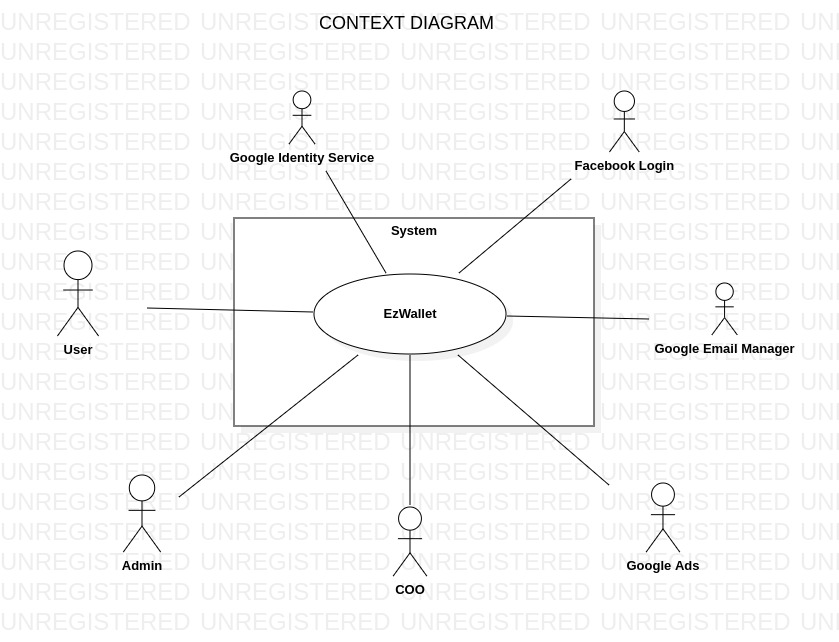
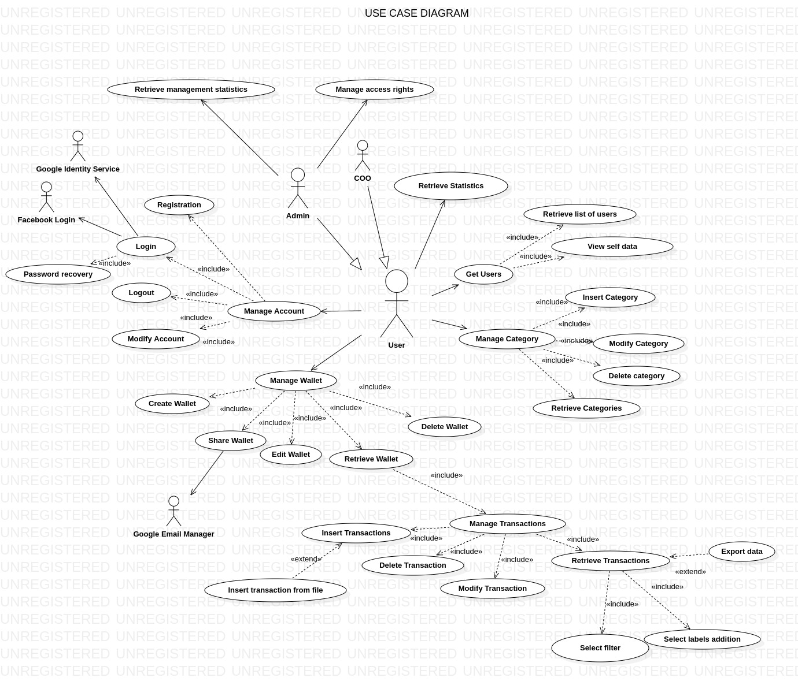
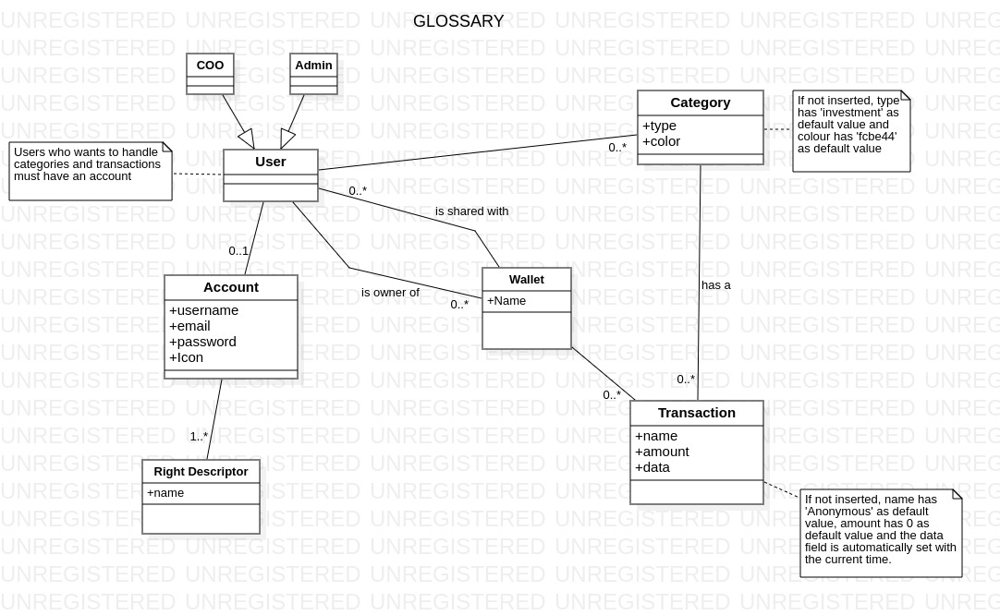
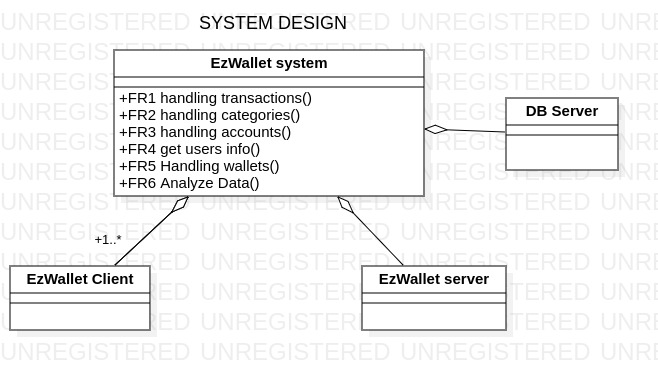
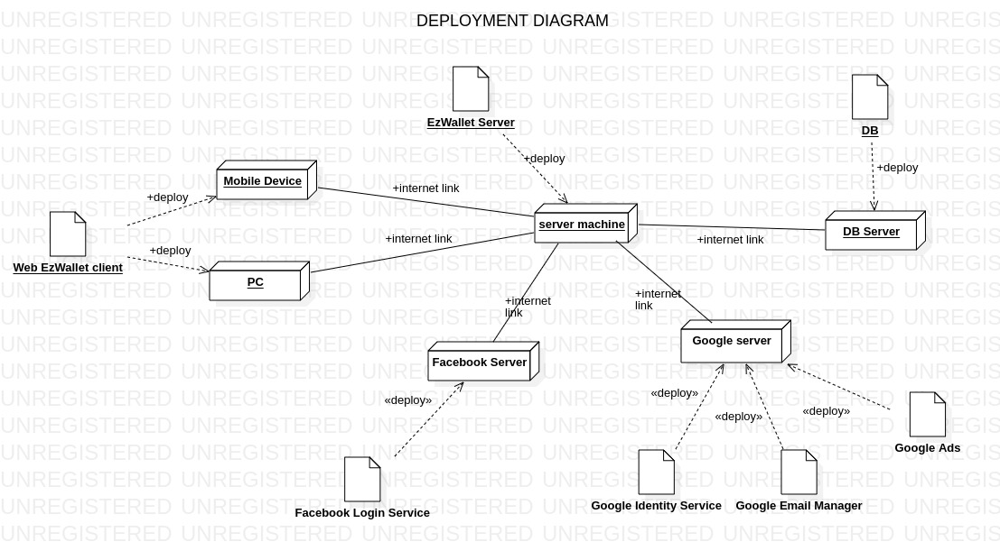

# Requirements Document - current EZWallet

Date: 28/04/2023

Version: V2 - addition of new functionalities and consistency

 
| Version number | Change |
| ----------------- |:-----------|
| 2.0 | - Admin actor   - Ads   - Authentication via external services   - Multiple Wallet   - Possibility to share a wallet   - Import/Export transactions   - Password recory   - Filtering operation   - Statistics operation| 

# Contents

- [Informal description](#informal-description)
- [Stakeholders](#stakeholders)
- [Context Diagram and interfaces](#context-diagram-and-interfaces)
	+ [Context Diagram](#context-diagram)
	+ [Interfaces](#interfaces) 
	
- [Stories and personas](#stories-and-personas)
- [Functional and non functional requirements](#functional-and-non-functional-requirements)
	+ [Functional Requirements](#functional-requirements)
	+ [Non functional requirements](#non-functional-requirements)
- [Use case diagram and use cases](#use-case-diagram-and-use-cases)
	+ [Use case diagram](#use-case-diagram)
	+ [Use cases](#use-cases)
    	+ [Relevant scenarios](#relevant-scenarios)
- [Glossary](#glossary)
- [System design](#system-design)
- [Deployment diagram](#deployment-diagram)

# Informal description
EZWallet (read EaSy Wallet) is a software application designed to help individuals and families keep track of their expenses. Users can enter and categorize their expenses, allowing them to quickly see where their money is going. EZWallet is a powerful tool for those looking to take control of their finances and make informed decisions about their spending. 
## Business model
Developed by private company that gain money via embedded ads in the application in order to support the project.

# Stakeholders
| Stakeholder name  | Description | 
| ----------------- |:-----------|
|   User       |   The final user that use the application for manage his own expenses |
| Admin  | Person who handles administration functions |
| COO    | The corporate executive who oversees ongoing business operations within the company |
| Google Ads  | API used to embedded ads |
| Google Identity Services | API for authentication via Google account |
| Facebook login  | API for the authentication via Facebook account |
| Google Email Manager | API for send emails to the users |
| Competitors (Tricount, Money Manage)|Competitor mobile apps for expenses management|

# Context Diagram and interfaces

## Context Diagram

## Interfaces

| Actor | Logical Interface | Physical Interface  |
| ------------- |:-------------:| :-----:|
|   User    | Web GUI v2 | Generic device (PC or Smartphone) |
|   Admin       | Web GUI v2 | PC |
|   Google Ads  | [API link](https://developers.google.com/google-ads/api/docs/start?sjid=10252163577206090748-EU&hl=it) | Internet Connection |
|   Google Identity Service  | [API description](https://developers.google.com/identity/gsi/web/guides/overview) | Internet Connection with OAuth protocol |
|   Facebook Login | [API description](https://developers.facebook.com/docs/facebook-login/overview) | Internet Connection with OAuth protocol|
| Email manager | [API link](https://developers.google.com/gmail/api/guides/sending) | Internet Connection |

# Stories and personas

-	Persona 1: middle-level income, 35-55 year old, with children
	-	He/she wants to keep track of the expenses related to the children separately from the other expenses categories 
-	Persona 2: low-level income, student, 19-25 year old
	-	Keep track of expenses during his/her study period, divided in categories in particular to track transport expenses for a university refund. 
-	Persona 3: middle-level income, 25-55 year old
	-	He is seeking for an easy way to keep track of the expeses during working trips in order to clearly report it to his company for the refund. 
-	Persona 4: high-level income, 25-55 year old
	-	He/she wants to keep track of the expenses during his/her trips to compare the amount of money spent in each one. He/She wants to assigne a category to each trip. 
-	Persona 5: student, 23 yo, uses mutiple online tools
	-	He/she wants to use a service for manage his money and a easy way to access, preferably with a third part autentication service that allow a passwordless access. 
-	Persona 6: middle-level income, 50 years old, married
	-	He/she wants share his/her wallet with her family
-	Persona 7: low-level income, 35-55 year old
	-	He/she wants to visualize the trend of his expenses during the last year in order to find when he/she has spent to much money and to improve his savings strategy during the next year.

# Functional and non functional requirements

## Functional Requirements

| ID        | Description  | Access rights |
| ------------- |-------------| :----: |
|  **FR1**     | **Handling transactions** | |
|  FR1.1      | Create transactions | |
|  FR1.1.1    | Insert new transaction | User, Admin |
|  FR1.1.2    | Insert new transactions from CSV file |  User, Admin |
|  FR1.2      | Retrieve transactions | |
|  FR1.2.1    | Get all transactions| User, Admin |
|  FR1.2.2    | Get all transactions with labels | User, Admin |
|  FR1.2.3    | Get transactions filtered by: Category, Date, Amount range, Name, income/expense | User, Admin |
|  FR1.2.4    | Export transactions data in a given file format (csv, txt)| User, Admin |
|  FR1.3      | Delete transaction | User, Admin |
|  FR1.4      | Modify transaction | User, Admin |
|  **FR2**     | **Handling categories** |
|  FR2.1      | Create new category | User, Admin |
|  FR2.2      | Get all categories | User, Admin |
|  FR2.3      | Modify category | User, Admin |
|  FR2.4      | Delete category | User, Admin |
|  **FR3**     | **Handling accounts** |
|  FR3.1      | Register | User, Admin |
|  FR3.2      | Login | |
|  FR3.2.1    | Login via email and password |User, Admin |
|  FR3.2.2    | Password recovery | User, Admin |
|  FR3.2.3    | Authentication with Google | User |
|  FR3.2.4    | Authentication with Facebook | User |
|  FR3.3      | Logout | User, Admin |
|  FR3.4      | Modify account | User, Admin |
|  FR3.5      | Authorization | User, Admin |
|  FR3.6      | Manage access rights | Admin |
|  **FR4**     | **Get users' info** |
|  FR4.1      | Get all users | Admin |
|  FR4.2      | Get self data |  User, Admin |
| **FR5**      | **Handling wallets** |
|  FR5.1      | Create new wallet | User, Admin |
|  FR5.2      | Modify a wallet | User, Admin |
|  FR5.3      | Delete a wallet | User, Admin |
|  FR5.4      | Share a wallet | User, Admin |
|  **FR6**     | **Analyze data** |
|  FR6.1      | Sum/Average/Min/Max of transactions in a given period of time (weekly/monthly/annual) |  User, Admin |
|  FR6.2      | Sum/Average/Min/Max of transactions by category|  User, Admin |
|  FR6.3      | Plot the trend of income/expenses over time(weekly/monthly/annual) | User, Admin |
|  FR6.4      | Number of registered users in a given period of time |  Admin |

## Non Functional Requirements

| ID        | Type (efficiency, reliability, ..)           | Description  | Refers to |
| ------------- |:-------------:| :-----:| -----:|
|  NFR1     | Usability  | Any person with a basic knowledge about technology should be able to handle core functions in two day |FR1, FR2, FR3, FR4, FR5 |
|  NFR2     | Portability | The transition to a future mobile app must be a low-effort operation (not more than 240ph) | all |
| NFR3 | Reliability | Max downtime is of 1 hour at month  | all |
|  NFR4     | Reliability | The probability of corruption must be low of 1% | FR1, FR2, FR3, FR5 |
|  NFR5     | Security | data related to transactions must be protected from malicious access | all |
| Domain1 | - | Euro | - | 

# Use case diagram and use cases

## Use case diagram

### **Note:** all UCs referred to User as actor can be considered also for the Admin, the inverse is not true.

### UC1: Insert Category

| Actors Involved        | User |
| ------------- |:-------------:| 
|  Precondition     | - |
|  Post condition     | - |
|  Nominal Scenario     | 1.1 |
|  Variants     | - |
|  Exceptions     | 1.2, 1.3|

| Scenario 1.1 | Nominal |
| ------------- |:-------------| 
|  Precondition     | User has an account and he/she has been authorized and authenticated |
|  Post condition     | User has created a new category in his wallet |
| **Step#**        | **Description**  |
|  1     | User selects "new category" functionality|
|  2     | User inserts type and color of the new category |
|  3     | System saves new category into the wallet |

| Scenario 1.2 | Exception |
| ------------- |:-------------| 
|  Precondition     | - |
|  Post condition     | The action is not performed by the system |
| **Step#**        | **Description**  |
|  1     | User selects "new category" functionality|
|  2     | System checks if the user is authorized for this operation |
|  3     | System informs the user that he/she is not authorized |

| Scenario 1.3 | Exception |
| ------------- |:-------------| 
|  Precondition     | - |
|  Post condition     | The action is not performed by the system |
| **Step#**        | **Description**  |
|  1     | User tries to insert a category |
|  2     | System checks if the category already exists |
|  3     | System informs the user that the category already exists |

### UC2: Retrieve categories

| Actors Involved        | User |
| ------------- |:-------------:| 
|  Precondition     | -|
|  Post condition     | - |
|  Nominal Scenario     | 2.1 |
|  Variants     | - |
|  Exceptions     | 2.2 |

| Scenario 2.1 | Nominal  |
| ------------- |:-------------| 
|  Precondition  | User has an account and he/she has been authorized and authenticated |
|  Post condition | User retrieves the list of categories |
| **Step#**        | **Description**  |
|  1     | User asks for the list of categories |
|  2     | System provides the list of categories |

| Scenario 2.2 | Exception |
| ------------- |:-------------| 
|  Precondition     | - |
|  Post condition     | The action is not performed by the system |
| **Step#**        | **Description**  |
|  1     | User asks for the list of categories |
|  2     | System checks if the user is authorized for this operation |
|  3     | System informs the user that he/she is not authorized |

### UC3: Modify Category

| Actors Involved        | User |
| ------------- |:-------------:| 
|  Precondition     | - |
|  Post condition     | - |
|  Nominal Scenario     | 3.1 |
|  Variants     | - |
|  Exceptions     | 3.2 |

| Scenario 3.1 | Nominal |
| ------------- |:-------------| 
|  Precondition     | User has an account and he/she has been authorized and authenticated |
|  Post condition     | User has modified a category |
| **Step#**        | **Description**  |
|  1     | User selects a category|
|  2     | User selects "modify" functionality for the selected category|
|  3     | User modify some fields|
|  4     | System overwrites category informations |

| Scenario 3.2 | Exception |
| ------------- |:-------------| 
|  Precondition     | - |
|  Post condition     | The action is not performed by the system |
| **Step#**        | **Description**  |
|  1     | User selects a category|
|  2     | User selects "modify category" functionality for the selected category|
|  3     | System checks if the user is authorized for this operation |
|  4     | System informs the user that he/she is not authorized |

| Scenario 3.3 | Exception |
| ------------- |:-------------| 
|  Precondition     | - |
|  Post condition     | The action is not performed by the system |
| **Step#**        | **Description**  |
|  1     | User selects a category|
|  2     | User selects "modify category" functionality for the selected category|
|  3     | User modify some fields|
|  4     | System checks if a category with the same type exists |
|  5     | System informs the user that the category already exists |

### UC4: Delete Category

| Actors Involved        | User |
| ------------- |:-------------:| 
|  Precondition     | - |
|  Post condition     | - |
|  Nominal Scenario     | 4.1 |
|  Variants     | - |
|  Exceptions     | 4.2, 4.3|

| Scenario 4.1 | Nominal |
| ------------- |:-------------| 
|  Precondition     | User has an account and he/she has been authorized and authenticated  |
|  Post condition     | User has deleted a category |
| **Step#**        | **Description**  |
|  1     | User selects a category|
|  2     | User selects "delete category" functionality for the selected category|
|  3     | System checks the abscence of transactions associated with the selected category|
|  4     | System removes the category|

| Scenario 4.2 | Exception |
| ------------- |:-------------| 
|  Precondition     | User has an account and he/she has been authorized and authenticated |
|  Post condition     | The action is not performed by the system |
| **Step#**        | **Description**  |
|  1     | User selects a category|
|  2     | User selects "delete category" functionality for the selected category|
|  3     | System checks the abscence of transaction associated with the selected category|
|  4     | System informs the user that there are transaction associated with the category |

| Scenario 4.3 | Exception |
| ------------- |:-------------| 
|  Precondition     | - |
|  Post condition     | The action is not performed by the system |
| **Step#**        | **Description**  |
|  1     | User selects a category|
|  2     | User selects "delete category" functionality for the selected category|
|  3     | System checks if the user is authorized for this operation |
|  4     | System informs the user that he/she is not authorized |

### UC5: Registration

| Actors Involved        | User |
| ------------- |:-------------:| 
|  Precondition     | - |
|  Post condition     | - |
|  Nominal Scenario     | 5.1 |
|  Variants     | - |
|  Exceptions     | 5.2 |

| Scenario 5.1 | Nominal |
| ------------- |:-------------| 
|  Precondition     |  User hasn't an account |
|  Post condition     | User account is created |
| **Step#**        | **Description**  |
|  1     | User asks the system to be registered |
|  2     | User inserts his data and the profile icon|
|  3     | User sends all the data to the system |
|  4     | System checks if the user already exists |
|  5     | System inserts the new user |

| Scenario 5.2 | Exception |
| ------------- |:-------------| 
|  Precondition     | User is already registered |
|  Post condition     | The action is not performed by the system |
| **Step#**        | **Description**  |
|  1     | User asks the system to be registered |
|  2     | User inserts his data and the profile icon|
|  3     | User sends all the data to the system |
|  4     | System checks if the user already exists |
|  5     | System informs the user that his data already exists |

### UC6: Login

| Actors Involved        | User, Google Identity Service, Facebook Login |
| ------------- |:-------------:| 
|  Precondition     | - |
|  Post condition     | - |
|  Nominal Scenario     | 4.1 |
|  Variants     | 4.2 |
|  Exceptions     | 4.3, 4.4|

| Scenario 4.1 | Nominal |
| ------------- |:-------------| 
|  Precondition     | User is already registered |
|  Post condition     | User is authenticated for this session |
| **Step#**        | **Description**  |
|  1     | User asks the system to log in |
|  2     | User inserts his credentials |
|  3     | User sends his credentials to the system |
|  4     | System checks if the credentials are correct |
|  5     | System gives the access to the user |

|Scenario 4.2 | Variant |
| ------------- |:-------------| 
|  Precondition     | User has a Google/Facebook Account |
|  Post condition     | User is authenticated for this session |
| **Step#**        | **Description**  |
|1|User asks the system to log in with Google/Facebook|
|4|Google Identity Service/Facebook Login gaves the authorization to system|
|5|System gives the access to the user|

| Scenario 4.3 | Exception |
| ------------- |:-------------| 
|  Precondition     | User is not yet registered |
|  Post condition     | The action is not performed by the system |
| **Step#**        | **Description**  |
|  1     | User asks the system to log in |
|  2     | User inserts his credentials |
|  3     | User sends his credentials to the system |
|  4     | System checks if the credentials are correct |
|  5     | System informs the user that his data doesn't exist |

| Scenario 4.4 | Exception |
| ------------- |:-------------| 
|  Precondition     | User is already registered |
|  Post condition     | The action is not performed by the system |
| **Step#**        | **Description**  |
|  1     | User asks the system to log in |
|  2     | User inserts his credentials |
|  3     | User sends his credentials to the system |
|  4     | System checks if the credentials are correct |
|  5     | System informs the user that the credentials are not correct |

### UC7: Password recovery
| Actors Involved        | User |
| ------------- |:-------------:| 
|  Precondition     | - |
|  Post condition     | - |
|  Nominal Scenario     | 7.1 |
|  Variants     | - |
|  Exceptions     | 7.2 |

|Scenario 7.1 | Nominal |
| ------------- |:-------------| 
|  Precondition     | User is registered |
|  Post condition     | Overwrite of the previous password |
| **Step#**        | **Description**  |
|1|User asks for password recovery|
|2|System asks email of the user whose password has been forgotten|
|3|System checks if the email corresponds to a registered user |
|4|System sends via email a recovery link |
|4|User clicks the link provided and set a new password for his profile|

|Scenario 7.2 | Exception |
| ------------- |:-------------| 
|  Precondition     | - |
|  Post condition     | The action is not performed by the system |
| **Step#**        | **Description**  |
|1|User asks for password recovery|
|2|System asks the email of the user whose password has been forgotten|
|3|System checks if the email corresponds to a registered user |
|4|Systen informs the user that the email is not present|

### UC8: Logout

| Actors Involved        | User |
| ------------- |:-------------:| 
|  Precondition     | User is logged in |
|  Post condition     | User ends the current session |
|  Nominal Scenario     | 8.1 |
|  Variants     | - |
|  Exceptions     | - |

| Scenario 8.1 | Nominal |
| ------------- |:-------------| 
|  Precondition     | - |
|  Post condition     | - |
| **Step#**        | **Description**  |
|  1     | User asks the system to logout |
|  2     | System removes the access from the current logged user |

### UC9: Modify Account

| Actors Involved        | User |
| ------------- |:-------------:| 
|  Precondition     | - |
|  Post condition     | - |
|  Nominal Scenario     | 9.1 |
|  Variants     | - |
|  Exceptions     | 9.2, 9.3 |

| Scenario 9.1 | Nominal |
| ------------- |:-------------| 
|  Precondition     | User has an account and he/she has been authorized and authenticated |
|  Post condition     | User has modified his profile |
| **Step#**        | **Description**  |
|  1     | User selects "modify profile" functionality|
|  2     | User modifies one or more fields|
|  3     | System updates the user's data |

| Scenario 9.3 | Exception |
| ------------- |:-------------| 
|  Precondition     | - |
|  Post condition     | The action is not performed by the system |
| **Step#**        | **Description**  |
|  1     | User selects "modify account" functionality |
|  2     | System checks if the user is authorized for this operation |
|  3     | System informs the user that he/she is not authorized |

### UC10: Retrieve list of users

| Actors Involved        | Admin, User |
| ------------- |:-------------:| 
|  Precondition     | - |
|  Post condition     | - |
|  Nominal Scenario     | 10.1 |
|  Variants     | - |
|  Exceptions     | 10.2 |

| Scenario 10.1 | Nominal |
| ------------- |:-------------| 
|  Precondition     | Admin has an account and he/she has been authorized and authenticated |
|  Post condition     | List of users is returned |
| **Step#**        | **Description**  |
|  1     | Admin asks the system the list of users |
|  2     | System checks if the access rights are respected |
|  3     | System returns the list of users|

| Scenario 10.2 | Extension |
| ------------- |:-------------| 
|  Precondition     | User has an account and he/she has been authorized and authenticated |
|  Post condition     | The action is not performed by the system |
| **Step#**        | **Description**  |
|  1     | Admin asks the system the list of users |
|  2     | System checks if the access rights are respected |
|  3     | System informs the user that the access is negated |

### UC11: View self data

| Actors Involved        | User |
| ------------- |:-------------:| 
|  Precondition     | - |
|  Post condition     | - |
|  Nominal Scenario     | 11.1 |
|  Variants     | - |
|  Exceptions     | 11.2 |

| Scenario 11.1 | Nominal |
| ------------- |:-------------| 
|  Precondition     | User exists and requests for his own data |
|  Post condition     | User's personal data are returned |
| **Step#**        | **Description**  |
|  1     | User asks the system for his data |
|  2     | System checks if the user is authenticated | 
|  3     | System checks if the user exists |
|  4     | System checks if the requested user corresponds to the current logged user |
|  5     | System returns the data of the user |

| Scenario 11.2 | Exception |
| ------------- |:-------------| 
|  Precondition     | User is no longer authenticated |
|  Post condition     | The action is not performed by the system |
| **Step#**        | **Description**  |
|  1     | User asks the system for user's data |
|  2     | System checks if the user is authenticated |
|  3     | System informs the user that he is not authenticated  |

### UC12: Insert Transaction

| Actors Involved        | User |
| ------------- |:-------------:| 
|  Precondition     | - |
|  Post condition     | - |
|  Nominal Scenario     | 12.1 |
|  Variants     |  12.2 |
|  Exceptions     | 12.3, 12.4 |

| Scenario 12.1 | Nominal |
| ------------- |:-------------| 
|  Precondition     | User has an account and he/she has been authorized and authenticated |
|  Post condition     | User has created a new transaction in his wallet |
| **Step#**        | **Description**  |
|  1     | User selects an existing wallet from his Wallet's list |
|  2     | User selects "new transaction" insert functionality |
|  3     | User inserts name, amount, category, date and icon of the new transaction |
|  4     | System checks if the inserted category exists |
|  5     | System saves new transaction into the wallet |

| Scenario 12.2 | Variant |
| ------------- |:-------------| 
|  Precondition     | User has an account and he/she has been authorized and authenticated |
|  Post condition     | User has created a new transaction in his wallet |
| **Step#**        | **Description**  |
|  1     | User selects new transaction insert functionality|
|  2     | User inserts only name, amount of the new transaction (mandatory fields)|
|  3     | System completes the transaction description with the default values |
|  4     | System saves new transaction into the wallet |

| Scenario 12.3 | Exception |
| ------------- |:-------------| 
|  Precondition     | User has an account and he/she has been authorized and authenticated |
|  Post condition     | The action is not performed by the system  |
| **Step#**        | **Description**  |
|  1     | User selects an existing wallet from his Wallet's list |
|  2     | User selects "new transaction" insert functionality |
|  3     | User inserts name, amount, category, date and icon of the new transaction |
|  4     | System checks if the inserted category exists |
|  5     | System informs the user that the inserted category currently doesn't exist |

| Scenario 12.4 | Exception |
| ------------- |:-------------| 
|  Precondition     | - |
|  Post condition     | The action is not performed by the system |
| **Step#**        | **Description**  |
|  1     | User selects an existing wallet from his Wallet's list |
|  2     | User selects "new transaction" insert functionality |
|  3     | System checks if the user is authorized for this operation |
|  4     | System informs the user that he/she is not authorized |

### UC13: Insert transactions from file

| Actors Involved        | User |
| ------------- |:-------------:| 
|  Precondition     | User has a CSV file exported form an external money excange application  |
|  Post condition     | - |
|  Nominal Scenario     | 13.1 |
|  Variants  | - |
|  Exceptions     | 13.2, 13.3 |

|Scenario 13.1 | Nominal |
| ------------- |:-------------| 
|  Precondition     | User has an account and he/she has been authorized and authenticated |
|  Post condition     | transactions are created |
| **Step#**        | **Description**  |
|1|User selects an existing wallet from his Wallet's list |
|2|User selects "import from file" functionality |
|3|User load a CSV file exported from an external payment service with a list of transacitons|
|4|System import the file and extract the data information for creating transactions|
|5|System checks if the data are formatted properly (without extra attributes) |
|6|System checks if there are duplicates comparing transaction's data. System discard duplicates| 
|7|System create transactions|

|Scenario 13.2 | Exception |
| ------------- |:-------------| 
|  Precondition     | User has an account and he/she has been authorized and authenticated |
|  Post condition     | The action is not performed by the system |
| **Step#**        | **Description**  |
|1| User selects an existing wallet from his Wallet's list |
|2| User selects "import from file" functionality |
|3| User load a CSV file exported from an external payment service with a list of transacitons|
|4| System import the file and extract the data information for creating transactions|
|5| System checks if the data are formatted properly (without extra attributes) |
|6| System import the file and doesn't have enought data for create a new transaction |
|7| System fail the import |

| Scenario 13.3 | Exception |
| ------------- |:-------------| 
|  Precondition     | - |
|  Post condition     | The action is not performed by the system |
| **Step#**        | **Description**  |
|  1     | User selects an existing wallet from his Wallet's list |
|  2     | User selects "new transaction" insert functionality |
|  3     | System checks if the user is authorized for this operation |
|  4     | System informs the user that he/she is not authorized |

### UC14: Delete Transaction

| Actors Involved        | User |
| ------------- |:-------------:| 
|  Precondition     | - |
|  Post condition     | - |
|  Nominal Scenario     | 14.1 |
|  Variants     |  |
|  Exceptions     | 14.2, 14.3 |

| Scenario 14.1 | Nominal |
| ------------- |:-------------| 
|  Precondition       | User has an account and he/she has been authorized and authenticated |
|  Post condition     | User has deleted a transaction in his wallet |
| **Step#**        | **Description**  |
|  1     | User selects an existing wallet from his Wallet's list |
|  2     | System shows the list of transactions associated with the selected wallet |
|  3     | User selects a transaction contained in the selected wallet|
|  4     | User selects "delete transaction" functionality for there selected transaction|
|  5     | System checks if the user is the owner of the wallet|
|  6    | System removes the transaction from the wallet|

| Scenario 14.2 | Exception |
| ------------- |:-------------| 
|  Precondition     | User has an account and he/she has been authorized and authenticated |
|  Post condition     | The action is not performed by the system |
| **Step#**        | **Description**  |
|  1     | User selects an existing wallet from his Wallet's list |
|  2     | System shows the list of transactions associated with the selected wallet |
|  3     | User selects a transaction contained in the selected wallet|
|  4     | User selects "delete transaction" functionality for the selected transaction|
|  5     | System checks if the user is the owner of the wallet|
|  6    | System notifies the user that he is not the owner of the wallet |

| Scenario 14.3 | Exception |
| ------------- |:-------------| 
|  Precondition     | - |
|  Post condition     | The action is not performed by the system |
| **Step#**        | **Description**  |
|  1     | User selects an existing wallet from his Wallet's list |
|  2     | System shows the list of transactions associated with the selected wallet |
|  3     | User selects a transaction contained in the selected wallet|
|  4     | User selects "delete transaction" functionality for the selected transaction|
|  5     | System checks if the user is authorized for this operation |
|  6     | System informs the user that he/she is not authorized |

### UC15: Retrieve transactions

| Actors Involved        | User |
| ------------- |:-------------:| 
|  Precondition     | - |
|  Post condition     | - |
|  Nominal Scenario     | 15.1 |
|  Variants     | - |
|  Exceptions     | 15.2 |

| Scenario 15.1 | Nominal|
| ------------- |:-------------| 
|  Precondition     | User has an account and he/she has been authorized and authenticated |
|  Post condition     | User retrieves the list of transactions |
| **Step#**        | **Description**  |
|  1     | User selects an existing wallet from his Wallet's list |
|  2     | System shows the list of transactions associated with the selected wallet |
|  3     | User selects the presence or absence of labels |
|  4     | User selects filters |
|  5     | Systems retrieves transactions |
|  6     | Systems displays transactions |

| Scenario 15.2 | Exception |
| ------------- |:-------------| 
|  Precondition     | User has an account and he/she has been authorized and authenticated |
|  Post condition     | - |
| **Step#**        | **Description**  |
|  1     | User selects an existing wallet from his Wallet's list |
|  2     | System shows the list of transactions associated with the selected wallet |
|  3     | User selects the presence or absence of labels |
|  4     | User selects zero or more filters for the transactions |
|  5	 | User asks for the transactions filtered as selected  |
|  6     | System retrieves the transactions filtered |
|  7     | System doesn't find any transaction for the specified filter |

### UC16: Create wallet

| Actors Involved        | User |
| ------------- |:-------------:| 
|  Precondition     | - |
|  Post condition     | - |
|  Nominal Scenario     | 16.1 |
|  Variants     | - |
|  Exceptions     | 16.2 |

| Scenario 16.1 | Nominal |
| ------------- |:-------------| 
|  Precondition     | User has an account and he/she has been authorized and authenticated |
|  Post condition     | A new wallet is added to the system |
| **Step#**        | **Description**  |
|  1     | User selects "New wallet" functionality |
|  2     | User inserts name of the wallet |
|  3     | System creates a new wallet |

| Scenario 16.2 | Exception |
| ------------- |:-------------| 
|  Precondition     | - |
|  Post condition     | The action is not performed by the system |
| **Step#**        | **Description**  |
|  1     | User selects "New wallet" functionality |
|  2     | System checks if the user is authorized for this operation |
|  3     | System informs the user that he/she is not authorized |

### UC17: Retrieve list of wallets

| Actors Involved        | User |
| ------------- |:-------------:| 
|  Precondition     | - |
|  Post condition     | - |
|  Nominal Scenario     | 17.1 |
|  Variants     | - |
|  Exceptions     | 17.2 |

| Scenario 17.1 | Nominal |
| ------------- |:-------------| 
|  Precondition     | User has an account and he/she has been authorized and authenticated |
|  Post condition     | List of wallets is returned |
| **Step#**        | **Description**  |
|  1     | User asks for the list of wallets | <!--- da rivedere --->
|  2     | System return the list of wallets |

| Scenario 17.2 | Exception |
| ------------- |:-------------| 
|  Precondition     | - |
|  Post condition     | The action is not performed by the system |
| **Step#**        | **Description**  |
|  1     | User asks for the list of wallets | <!--- da rivedere --->
|  2     | System checks if the user is authorized for this operation |
|  3     | System informs the user that he/she is not authorized |

### UC18: Modify wallet

| Actors Involved        | User |
| ------------- |:-------------:| 
|  Precondition     | - |
|  Post condition     | - |
|  Nominal Scenario     | 18.1 |
|  Variants     | - |
|  Exceptions     | 18.2, 18.3 |

| Scenario 18.1 | Nominal |
| ------------- |:-------------| 
|  Precondition     | User has an account and he/she has been authorized and authenticated |
|  Post condition     | The modifications are applied |
| **Step#**        | **Description**  |
|  1     | User selects an existing wallet from his Wallet's list |
|  2     | User selects "Edit wallet" functionality|
|  3     | System checks if the user is the owner of the wallet|
|  4     | User modifies one or more fields|
|  5     | System updates the wallet's data |

| Scenario 18.2 | Exception |
| ------------- |:-------------| 
|  Precondition     | User has an account and he/she has been authorized and authenticated |
|  Post condition     | The modifications are applied |
| **Step#**        | **Description**  |
|  1     | User selects an existing wallet from his Wallet's list |
|  2     | User selects "Edit wallet" functionality|
|  3     | System checks if the user is the owner of the wallet|
|  4    | System informs the user that he is not the owner of the wallet |

| Scenario 18.3 | Exception |
| ------------- |:-------------| 
|  Precondition     | - |
|  Post condition     | The action is not performed by the system |
| **Step#**        | **Description**  |
|  1     | User selects an existing wallet from his Wallet's list |
|  2     | User selects "Edit wallet" functionality|
|  3     | System checks if the user is authorized for this operation |
|  4     | System informs the user that he/she is not authorized |

### UC19: Delete Wallet

| Actors Involved        | User |
| ------------- |:-------------:| 
|  Precondition     | - |
|  Post condition     | - |
|  Nominal Scenario     | 19.1 |
|  Variants     | - |
|  Exceptions     | 19.2 |

| Scenario 19.1 | Nominal |
| ------------- |:-------------| 
|  Precondition     | User has an account and he/she has been authorized and authenticated |
|  Post condition     | User has deleted the wallet |
| **Step#**        | **Description**  |
|  1     | User selects an existing wallet from his Wallet's list |
|  2     | User selects "delete wallet" functionality|
|  3     | System checks if the user is the owner of the wallet|
|  4     | System removes the wallet and its associated transactions|

| Scenario 19.2 | Exception |
| ------------- |:-------------| 
|  Precondition     | User has an account and he/she has been authorized and authenticated |
|  Post condition     | User has deleted the wallet |
| **Step#**        | **Description**  |
|  1     | User selects an existing wallet from his Wallet's list |
|  2     | User selects "delete wallet" functionality|
|  3     | System checks if the user is the owner of the wallet|
|  4     | System informs the user that he is not the owner of the wallet |

| Scenario 19.3 | Exception |
| ------------- |:-------------| 
|  Precondition     | - |
|  Post condition     | The action is not performed by the system |
| **Step#**        | **Description**  |
|  1     | User selects an existing wallet from his Wallet's list |
|  2     | User selects "delete wallet" functionality|
|  3     | System checks if the user is authorized for this operation |
|  4     | System informs the user that he/she is not authorized |

### UC20: Share Wallet

| Actors Involved        | User |
| ------------- |:-------------:| 
|  Precondition     | - |
|  Post condition     | - |
|  Nominal Scenario     | 20.1 |
|  Variants     | - |
|  Exceptions     | 20.2, 20.3 |

| Scenario 20.1 | Nominal |
| ------------- |:-------------| 
|  Precondition     | - User has an account and he/she has been authorized and authenticated   - The other user(s) exist(s)  |
|  Post condition     | The wallet being shared |
| **Step#**        | **Description**  |
|  1     | User selects an existing wallet from his Wallet's list |
|  2     | User selects "share wallet" functionality|
|  3     | System checks if the user is the owner of the wallet|
|  4     | User enters the emails of users with whom he/she wants to share the wallet|
|  5     | System checks if the selected users are actually registered|
|  6     | From now the wallet is defined as shared |
|  7     | System sends a notification via email to the selected users |

| Scenario 20.2 | Exception |
| ------------- |:-------------| 
|  Precondition     | - User has an account and he/she has been authorized and authenticated   - The other user(s) not exist(s)  |
|  Post condition     | The wallet being shared |
| **Step#**        | **Description**  |
|  1     | User selects an existing wallet from his Wallet's list |
|  2     | User selects "share wallet" functionality|
|  3     | System checks if the user is the owner of the wallet|
|  4     | User enters the emails of users with whom he/she wants to share the wallet|
|  5     | System checks if the selected users are actually registered |
|  6     | System blocks the share operation until existing emails in the system are inserted |

| Scenario 20.3 | Exception |
| ------------- |:-------------| 
|  Precondition     | - |
|  Post condition     | The action is not performed by the system |
| **Step#**        | **Description**  |
|  1     | User selects an existing wallet from his Wallet's list |
|  2     | User selects "share wallet" functionality|
|  3     | System checks if the user is authorized for this operation |
|  4     | System informs the user that he/she is not authorized |

### UC21: Export data
| Actors Involved        | User |
| ------------- |:-------------:| 
|  Precondition     | - |
|  Post condition     | - |
|  Nominal Scenario     | 21.1 |
|  Variants     | - |
|  Exceptions     | 21.2 |

| Scenario 21.1 |Nominal|
| ------------- |:-------------| 
|  Precondition     | - User has an account and he/she has been authorized and authenticated   - Systems has displayed the transactions with filters selected by the user |
|  Post condition     | User retrieves the transactions data in the choosen file format|
| **Step#**        | **Description**  |
|  1     | User selects an existing wallet from his Wallet's list |
|  2     | User selects "export transactions" functionality|
|  3     | User selects a specific file format |
|  4     | System retrieves the transactions|
|  5     | System maps the transactions' data into the the selected file format|
|  6     | System exports the file created |

| Scenario 21.2 | Exception |
| ------------- |:-------------| 
|  Precondition     | - |
|  Post condition     | The action is not performed by the system |
| **Step#**        | **Description**  |
|  1     | User selects an existing wallet from his Wallet's list |
|  2     | User selects "export transactions" functionality|
|  3     | System checks if the user is authorized for this operation |
|  4     | System informs the user that he/she is not authorized |

### UC22: Retrieve statistics

| Actors Involved        | User |
| ------------- |:-------------:| 
|  Precondition     | - |
|  Post condition     | - |
|  Nominal Scenario     | 22.1|
|  Variants     | - |
|  Exceptions     | - |

| Scenario 22.1 | Nominal |
| ------------- |:-------------| 
|  Precondition     | User has an account and he/she has been authorized and authenticated |
|  Post condition     | User retrieves the choosen statistics|
| **Step#**        | **Description**  |
|  1     | User selects "statistics" functionality|
|  2     | User selects one or more statistics to visualize |
|  3	 | User selects the parameters of the statistics|
|  4     | System retrieves the data useful for the computation |
|  5     | System computes the statistics|
|  6     | System displays the statistics|

| Scenario 22.2 | Exception |
| ------------- |:-------------| 
|  Precondition     | - |
|  Post condition     | The action is not performed by the system |
| **Step#**        | **Description**  |
|  1     | User selects "statistics" functionality|
|  2     | System checks if the user is authorized for this operation |
|  3     | System informs the user that he/she is not authorized |

### UC23: Retrieve management statistics

| Actors Involved        | Admin |
| ------------- |:-------------:| 
|  Precondition     | - |
|  Post condition     | - |
|  Nominal Scenario     | 23.1|
|  Variants     |-|
|  Exceptions     |23.2|

| Scenario 23.1 | Nominal |
| ------------- |:-------------| 
|  Precondition     | User is authenticated with admin privileges |
|  Post condition   |Admin has retrieved the number of users subscribed during a given period of time|
| **Step#**        | **Description**  |
|  1     | System recognizes the user logged in as Admin |
|  2     | System shows the "management statistics" functionality |
|  3     | Admin enters in the management statistics page |
|  4     | Admin selects a given period of time|
|  5     | System retrieves the users subscribed during that period of time|
|  6     | System displays the users and the total count|

| Scenario 23.2 | Exception |
| ------------- |:-------------| 
|  Precondition     | - |
|  Post condition     | - |
| **Step#**        | **Description**  |
|  1     | System recognizes that the user currently logged is not an Admin |
|  2     | System doesn't show the "management statistics" functionality |

<!--- --->
### UC24: Manage Access Rights

| Actors Involved        | Admin |
| ------------- |:-------------:| 
|  Precondition     | - |
|  Post condition     | - |
|  Nominal Scenario     | 24.1|
|  Variants     |-|
|  Exceptions     |24.2|

| Scenario 24.1 | Nominal |
| ------------- |:-------------| 
|  Precondition     | User is authenticated with admin privileges |
|  Post condition   | Zero, one or more users become admins|
| **Step#**        | **Description**  |
|  1     | System recognizes the user logged in as Admin |
|  2     | System shows the "manage access rights" functionality |
|  3     | Admin enters in the manage access rights page |
|  4     | Systems shows the list of users |
|  5     | Admin may selects one or more users and gives to them admin privileges |
|  6     | System updates access rights |

| Scenario 24.2 | Exception |
| ------------- |:-------------| 
|  Precondition     | - |
|  Post condition     | - |
| **Step#**        | **Description**  |
|  1     | System recognizes that the user currently logged is not an Admin |
|  2     | System doesn't show the "manage access rights" functionality |

# Glossary

# System Design

# Deployment Diagram 
