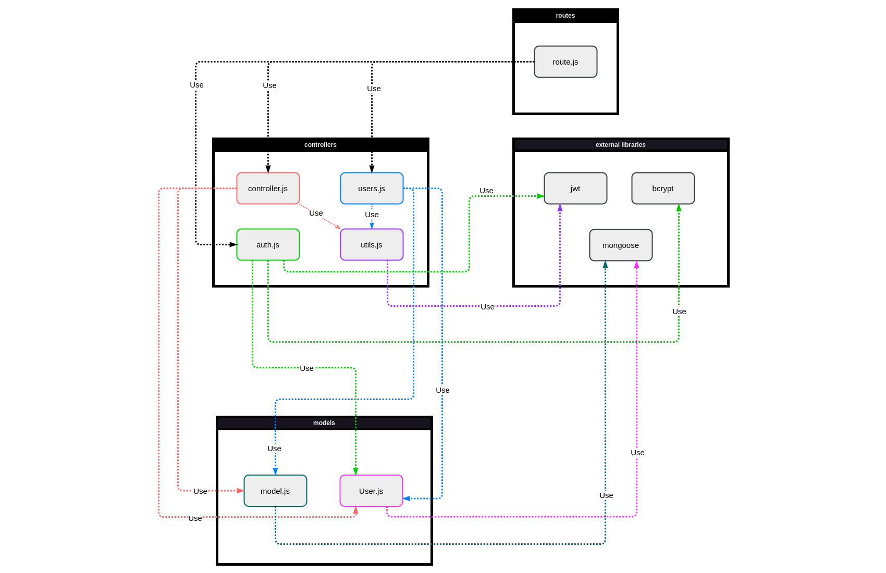

# Test Report

The goal of this document is to explain how the application was tested, detailing how the test cases were defined and what they cover.

# Contents

- [Dependency graph](#dependency-graph)

- [Integration approach](#integration-approach)

- [Tests](#tests)

- [Coverage](#Coverage)

# Dependency graph 

# Integration approach

### Mixed approach:
We decided to divide our team in order to cover different functions from the ones that each of us has implemented. Thus, we work in parallel on different unit and integration tests. 

* Step #1: API testing
* Step #2 (parallel): unit tests valid input & invalid input
    * controller.js 
    * users.js
    * auth.js
    * utils.js
* Step #3 (parallel): integration tests valid input & invalid input
    * testing functions together also with external libraries
    

# Tests

Decision set: { response 200, responses 400 }

| Test case name | Object(s) tested | Test level | Technique used |
|--|--|--|--|
| Returns an object with a property date passing date (with properties <$gte> and <$lte>) | handleDateFilterParams | Unit | WB - Decision Coverage |
 | Returns an object with a property date passing from (only $gte property) | handleDateFilterParams | Unit | WB - Decision Coverage |
 | Returns an object with a property date passing upTo (only $lte property) | handleDateFilterParams | Unit | WB - Decision Coverage |
 | Returns an object with a property date passing from and upTo (with properties <$gte> and <$lte>) | handleDateFilterParams | Unit | WB - Decision Coverage |
 | Returns errors | handleDateFilterParams | Unit | WB - Decision Coverage |
 | Returns empty | handleDateFilterParams | Unit | WB - Decision Coverage |
 | Simple auth: Should return a flag/label setted to true | verifyAuth | Unit | WB - Decision Coverage |
 | Simple auth: Should return a flag/label setted to false (missing informations) | verifyAuth | Unit | WB - Decision Coverage |
 | User auth: Should return a flag/label setted to true | verifyAuth | Unit | WB - Decision Coverage |
 | User auth: Should return a flag/label setted to false (mismatched informations) | verifyAuth | Unit | WB - Decision Coverage |
 | User auth: Should return a flag/label setted to false (request for a different user) | verifyAuth | Unit | WB - Decision Coverage |
 | Admin auth: Should return a flag/label setted to true | verifyAuth | Unit | WB - Decision Coverage |
 | Admin auth: Should return a flag/label setted to false (requested auth for a different role) | verifyAuth | Unit | WB - Decision Coverage |
 | Group auth: Should return a flag/label setted to true | verifyAuth | Unit | WB - Decision Coverage |
 | Group auth: Should return a flag/label setted to false (mail of the token not present in the group) | verifyAuth | Unit | WB - Decision Coverage |
 | Simple auth: Should return a flag/label setted to true and set the new accessToken | verifyAuth | Unit | WB - Decision Coverage |
 | User auth: Should return a flag/label setted to true and set the new accessToken | verifyAuth | Unit | WB - Decision Coverage |
 | Admin auth: Should return a flag/label setted to true and set the new accessToken | verifyAuth | Unit | WB - Decision Coverage |
 | Group auth: Should return a flag/label setted to true and set the new accessToken | verifyAuth | Unit | WB - Decision Coverage |
 | Error auth: Should return a flag/label setted to false (undefined auth) | verifyAuth | Unit | WB - Decision Coverage |
 | Error auth: Should return a flag/label setted to false (perform login again) | verifyAuth | Unit | WB - Decision Coverage |
 | Correct email format: Should return true | verifyEmail | Unit | WB - Decision Coverage |
 | Incorrect email format: Should return false | verifyEmail | Unit | WB - Decision Coverage |
 | Should return the condition just for the min | handleAmountFilterParams | Unit | WB - Decision Coverage |
 | Should return the condition for the min and max | handleAmountFilterParams | Unit | WB - Decision Coverage |
 | Should return error (min is not a number), max is a number | handleAmountFilterParams | Unit | WB - Decision Coverage |
 | Should return error (max is not a number), min is a number | handleAmountFilterParams | Unit | WB - Decision Coverage |
 | Should return error (min is not a number) | handleAmountFilterParams | Unit | WB - Decision Coverage |
 | Should return error (max is not a number) | handleAmountFilterParams | Unit | WB - Decision Coverage |
 | Should return an ampty result | handleAmountFilterParams | Unit | WB - Decision Coverage |
 | Should return status code 200 | register | Unit | WB - Decision Coverage |
 | Should return status code 400: the request body does not contain all the necessary attributes | register | Unit | WB - Decision Coverage |
 | Should return status code 400: at least one of the parameters in the request body is an empty string | register | Unit | WB - Decision Coverage |
 | Should return status code 400: the email in the request body is not in a valid email format | register | Unit | WB - Decision Coverage |
 | Should return status code 400: the username in the request body identifies an already existing user | register | Unit | WB - Decision Coverage |
 | Should return status code 400: the email in the request body identifies an already existing user | register | Unit | WB - Decision Coverage |
 | status 200 when successful creates an admin | registerAdmin | Unit | WB - Decision Coverage |
 | status 400 req does not contain all inputs | registerAdmin | Unit | WB - Decision Coverage |
 | status 400 if req contains an empty param | registerAdmin | Unit | WB - Decision Coverage |
 | status 400 if email is not valid | registerAdmin | Unit | WB - Decision Coverage |
 | status 400 if there is an already existing email | registerAdmin | Unit | WB - Decision Coverage |
 | status 400 if there is an already existing username | registerAdmin | Unit | WB - Decision Coverage |
 | should return 200 for correct login | login | Unit | WB - Decision Coverage |
 | should return 400 if the request body does not contain all the necessary attributes | login | Unit | WB - Decision Coverage |
 | should return 400 if at least one of the parameters in the request body is an empty string | login | Unit | WB - Decision Coverage |
 | should return 400 if the email in the request body is not in a valid email format | login | Unit | WB - Decision Coverage |
 | 200 logout | logout | Unit | WB - Decision Coverage |
 | 400 logout | logout | Unit | WB - Decision Coverage |
 | Should return status code 200 | createCategory | Unit | WB - Decision Coverage |
 | Should return status code 400, missing parameters | createCategory | Unit | WB - Decision Coverage |
 | Should return status code 400, a parameter has an empty string | createCategory | Unit | WB - Decision Coverage |
 | Should return status code 400, already existing category | createCategory | Unit | WB - Decision Coverage |
 | Should return status code 401, the user is not an admin | createCategory | Unit | WB - Decision Coverage |
 | Should return status code 200 | updateCategory | Unit | WB - Decision Coverage |
 | Should return status code 400: request body does not contain all the necessary attributes | updateCategory | Unit | WB - Decision Coverage |
 | Should return status code 400: at least one of the parameters in the request body is an empty string | updateCategory | Unit | WB - Decision Coverage |
 | Should return status code 400: the type of category passed as a route parameter does not represent a category in the database | updateCategory | Unit | WB - Decision Coverage |
 | Should return status code 400: the type of category passed in the request body as the new type represents an already existing category in the database and that category is not the same as the requested one | updateCategory | Unit | WB - Decision Coverage |
 | Should return status code 401: called by an authenticated user who is not an admin (authType = Admin) | updateCategory | Unit | WB - Decision Coverage |
 | Should return status code 200 | deleteCategory | Unit | WB - Decision Coverage |
 | Should return status code 200 having categories in the database equal to the categories to be deleted | deleteCategory | Unit | WB - Decision Coverage |
 | Should return status code 400: the request body does not contain all the necessary attributes | deleteCategory | Unit | WB - Decision Coverage |
 | Should return status code 400: there is only one category in the database | deleteCategory | Unit | WB - Decision Coverage |
 | Should return status code 400: at least one of the types in the array is an empty string | deleteCategory | Unit | WB - Decision Coverage |
 | Should return status code 400: the array passed in the request body is empty | deleteCategory | Unit | WB - Decision Coverage |
 | Should return status code 400: at least one of the types in the array does not represent a category in the database | deleteCategory | Unit | WB - Decision Coverage |
 | Should return status code 401: called by an authenticated user who is not an admin (authType = Admin) | deleteCategory | Unit | WB - Decision Coverage |
 | return status 200 and correct data | getCategories | Unit | WB - Decision Coverage |
 | return status 200 and empty data with empty db | getCategories | Unit | WB - Decision Coverage |
 | return status 401 for not admin call | getCategories | Unit | WB - Decision Coverage |
 | Should return status code 200 | createTransaction | Unit | WB - Decision Coverage |
 | Should return status code 400, missing parameters | createTransaction | Unit | WB - Decision Coverage |
 | Should return status code 400, empty string | createTransaction | Unit | WB - Decision Coverage |
 | Should return status code 400, category not present | createTransaction | Unit | WB - Decision Coverage |
 | Should return status code 400, user in body mismatch user in params | createTransaction | Unit | WB - Decision Coverage |
 | Should return status code 400, user not in the db | createTransaction | Unit | WB - Decision Coverage |
 | Should return status code 400, amount cannot be parsed | createTransaction | Unit | WB - Decision Coverage |
 | Should return status code 401, called by different user then route param | createTransaction | Unit | WB - Decision Coverage |
 | return status 200 and correct data | getAllTransactions | Unit | WB - Decision Coverage |
 | return status 401 for not admin call | getAllTransactions | Unit | WB - Decision Coverage |
 | Admin route: Should return status code 200 | getTransactionsByUser | Unit | WB - Decision Coverage |
 | User router: Should return status code 200 | getTransactionsByUser | Unit | WB - Decision Coverage |
 | Should return status code 400: the username passed as a route parameter does not represent a user in the database | getTransactionsByUser | Unit | WB - Decision Coverage |
 | Should return status code 401: called by an authenticated user who is not the same user as the one in the route (authType = User) if the route is `/api/users/:username/transactions` | getTransactionsByUser | Unit | WB - Decision Coverage |
 | Should return status code 401: called by an authenticated user who is not an admin (authType = Admin) if the route is `/api/transactions/users/:username` | getTransactionsByUser | Unit | WB - Decision Coverage |
 | Should return status code 200 (admin route) | getTransactionsByUserByCategory | Unit | WB - Decision Coverage |
 | Should return status code 200 (user route) | getTransactionsByUserByCategory | Unit | WB - Decision Coverage |
 | Should return status code 400, user not in the db (admin route) | getTransactionsByUserByCategory | Unit | WB - Decision Coverage |
 | Should return status code 400, user not in the db (user route) | getTransactionsByUserByCategory | Unit | WB - Decision Coverage |
 | Should return status code 400, category not in the db (admin route) | getTransactionsByUserByCategory | Unit | WB - Decision Coverage |
 | Should return status code 400, category not in the db (user route) | getTransactionsByUserByCategory | Unit | WB - Decision Coverage |
 | Should return status code 401, user is not admin (admin route) | getTransactionsByUserByCategory | Unit | WB - Decision Coverage |
 | Should return status code 400, user not the same as route (user route) | getTransactionsByUserByCategory | Unit | WB - Decision Coverage |
 | Should return status code 200 (admin route) | getTransactionsByGroup | Unit | WB - Decision Coverage |
 | Should return status code 200 (user route) | getTransactionsByGroup | Unit | WB - Decision Coverage |
 | Should return status code 400, group not in the db (admin route) | getTransactionsByGroup | Unit | WB - Decision Coverage |
 | Should return status code 400, group not in the db (user route) | getTransactionsByGroup | Unit | WB - Decision Coverage |
 | Should return status code 401, user is not admin (admin route) | getTransactionsByGroup | Unit | WB - Decision Coverage |
 | Should return status code 401, user not in the group (user route) | getTransactionsByGroup | Unit | WB - Decision Coverage |
 | Should return status code 200 (admin route) | getTransactionsByGroupByCategory | Unit | WB - Decision Coverage |
 | Should return status code 200 (user route) | getTransactionsByGroupByCategory | Unit | WB - Decision Coverage |
 | Should return status code 400, group not in the db (admin route) | getTransactionsByGroupByCategory | Unit | WB - Decision Coverage |
 | Should return status code 400, group not in the db (user route) | getTransactionsByGroupByCategory | Unit | WB - Decision Coverage |
 | Should return status code 400, category not in the db (admin route) | getTransactionsByGroupByCategory | Unit | WB - Decision Coverage |
 | Should return status code 400, category not in the db (user route) | getTransactionsByGroupByCategory | Unit | WB - Decision Coverage |
 | Should return status code 401, user is not an admin (admin route) | getTransactionsByGroupByCategory | Unit | WB - Decision Coverage |
 | Should return status code 401, user not in the group (user route) | getTransactionsByGroupByCategory | Unit | WB - Decision Coverage |
 | Should return status code 200 | deleteTransaction | Unit | WB - Decision Coverage |
 | Should return status code 400, missing body parameters | deleteTransaction | Unit | WB - Decision Coverage |
 | Should return status code 400, empty id | deleteTransaction | Unit | WB - Decision Coverage |
 | Should return status code 400, user not in the db | deleteTransaction | Unit | WB - Decision Coverage |
 | Should return status code 400, transaction not in the db | deleteTransaction | Unit | WB - Decision Coverage |
 | Should return status code 400, transaction belong to a different user | deleteTransaction | Unit | WB - Decision Coverage |
 | Should return status code 401, user is not the same as the route | deleteTransaction | Unit | WB - Decision Coverage |
 | Should return status code 200 | deleteTransactions | Unit | WB - Decision Coverage |
 | Should return status code 400, missing body attribute | deleteTransactions | Unit | WB - Decision Coverage |
 | Should return status code 400, one empty string | deleteTransactions | Unit | WB - Decision Coverage |
 | Should return status code 400, transaction not in the db | deleteTransactions | Unit | WB - Decision Coverage |
 | Should return status code 401, user is not an admin | deleteTransactions | Unit | WB - Decision Coverage |
 | (status 200) should return empty list if there are no users | getUsers | Unit | WB - Decision Coverage |
 | (status 200) should retrieve list of all users | getUsers | Unit | WB - Decision Coverage |
 | should return status code 200 | createGroup | Unit | WB - Decision Coverage |
 | should return status code 400 for incomplete body req | createGroup | Unit | WB - Decision Coverage |
 | should return status code 400 for empty name in req | createGroup | Unit | WB - Decision Coverage |
 | should return status code 400 for existing group | createGroup | Unit | WB - Decision Coverage |
 | should return status code 400 for existing group | createGroup | Unit | WB - Decision Coverage |
 | should return status code 400 if the caller is in a group | createGroup | Unit | WB - Decision Coverage |
 | should return status code 400 for email invalid format | createGroup | Unit | WB - Decision Coverage |
 | should return status code 400 for empty email string | createGroup | Unit | WB - Decision Coverage |
 | should return status code 400 for duplicated memeber emails | createGroup | Unit | WB - Decision Coverage |
 | should return status code 401 for unauthenticated user | createGroup | Unit | WB - Decision Coverage |
 | (status 200) should retrieve another user if i have auth | getUser | Unit | WB - Decision Coverage |
 | (status 400) user not found, should retreive an error | getUser | Unit | WB - Decision Coverage |
 | (status 401) no auth | getUser | Unit | WB - Decision Coverage |
 | should return status 200 | getGroups | Unit | WB - Decision Coverage |
 | should return status 401 for call by a unauthorized user | getGroups | Unit | WB - Decision Coverage |
 | (status 200) should return all the group information | getGroup | Unit | WB - Decision Coverage |
 | (400) group not in the database | getGroup | Unit | WB - Decision Coverage |
 | (401) group doesnt have auth  | getGroup | Unit | WB - Decision Coverage |
 | (status 200)[REGULAR] should return all added user | addToGroup | Unit | WB - Decision Coverage |
 | (400) request body does not contain all the necessary attributes | addToGroup | Unit | WB - Decision Coverage |
 | (400) group name passed as a route parameter does not represent a group in the database | addToGroup | Unit | WB - Decision Coverage |
 | (400) if all the provided emails represent users that are already in a group | addToGroup | Unit | WB - Decision Coverage |
 | (400) if all the provided emails represent users that do not exist in the database | addToGroup | Unit | WB - Decision Coverage |
 | (400) at least one of the member emails is an empty string | addToGroup | Unit | WB - Decision Coverage |
 | (401) if called by an authenticated user who is not part of the group (authType = Group) | addToGroup | Unit | WB - Decision Coverage |
 | (401) if called by an authenticated user who is not an admin (authType = Admin) | addToGroup | Unit | WB - Decision Coverage |
 | (status 200)[REGULAR] should return group without removed users | removeFromGroup | Unit | WB - Decision Coverage |
 | (status 200)[ADMIN] should return group without removed users | removeFromGroup | Unit | WB - Decision Coverage |
 | (400) request body does not contain all the necessary attributes | removeFromGroup | Unit | WB - Decision Coverage |
 | (400) group name passed as a route parameter does not represent a group in the database | removeFromGroup | Unit | WB - Decision Coverage |
 | (400) all the provided emails represent users that do not exist in the database | removeFromGroup | Unit | WB - Decision Coverage |
 | (400) at least one of the emails is not in a valid email format | removeFromGroup | Unit | WB - Decision Coverage |
 | (400) at least one of the emails is an empty string | removeFromGroup | Unit | WB - Decision Coverage |
 | (400) the group contains only one member before deleting any user | removeFromGroup | Unit | WB - Decision Coverage |
 | (401) called by an authenticated user who is not part of the group (authType = Group) | removeFromGroup | Unit | WB - Decision Coverage |
 | (401) called by an authenticated user who is not admin (authType = Admin) | removeFromGroup | Unit | WB - Decision Coverage |
 | (status: 200) deletion of user and its group and transactions | deleteUser | Unit | WB - Decision Coverage |
 | should return status 400 for body without necessary attributes | deleteUser | Unit | WB - Decision Coverage |
 | Returns a 400 error if the email passed in the request body is an empty string | deleteUser | Unit | WB - Decision Coverage |
 | Returns a 400 error if the email passed in the request body is not in correct email format | deleteUser | Unit | WB - Decision Coverage |
 | Returns a 401 error if called by an authenticated user who is not an admin (authType = Admin) | deleteUser | Unit | WB - Decision Coverage |
 | should return status 200 for successful deletion | deleteGroup | Unit | WB - Decision Coverage |
 | should return status 400 for body without necessary attributes | deleteGroup | Unit | WB - Decision Coverage |
 | should return status 400 empty string name in the body | deleteGroup | Unit | WB - Decision Coverage |
 | should return status 400 for a group that is not in the database | deleteGroup | Unit | WB - Decision Coverage |
 | should return status 401 when called by a user that is not an admin | deleteGroup | Unit | WB - Decision Coverage |
 | Simple auth: Should return a flag/label setted to true | verifyAuth | Integration | BB - Equivalence classes partitioning |
 | Simple auth: Should return a flag/label setted to false (missing informations) | verifyAuth | Integration | BB - Equivalence classes partitioning |
 | User auth: Should return a flag/label setted to true | verifyAuth | Integration | BB - Equivalence classes partitioning |
 | User auth: Should return a flag/label setted to false (mismatched informations) | verifyAuth | Integration | BB - Equivalence classes partitioning |
 | User auth: Should return a flag/label setted to false (request for a different user) | verifyAuth | Integration | BB - Equivalence classes partitioning |
 | Admin auth: Should return a flag/label setted to true | verifyAuth | Integration | BB - Equivalence classes partitioning |
 | Admin auth: Should return a flag/label setted to false (requested auth for a different role) | verifyAuth | Integration | BB - Equivalence classes partitioning |
 | Group auth: Should return a flag/label setted to true | verifyAuth | Integration | BB - Equivalence classes partitioning |
 | Group auth: Should return a flag/label setted to false (mail of the token not present in the group) | verifyAuth | Integration | BB - Equivalence classes partitioning |
 | Simple auth: Should return a flag/label setted to true and set the new accessToken | verifyAuth | Integration | BB - Equivalence classes partitioning |
 | User auth: Should return a flag/label setted to true and set the new accessToken | verifyAuth | Integration | BB - Equivalence classes partitioning |
 | Admin auth: Should return a flag/label setted to true and set the new accessToken | verifyAuth | Integration | BB - Equivalence classes partitioning |
 | Group auth: Should return a flag/label setted to true and set the new accessToken | verifyAuth | Integration | BB - Equivalence classes partitioning |
 | Error auth: Should return a flag/label setted to false (undefined auth) | verifyAuth | Integration | BB - Equivalence classes partitioning |
 | Error auth: Should return a flag/label setted to false (perform login again) | verifyAuth | Integration | BB - Equivalence classes partitioning |
 | Should return 200 and register the user | register | Integration | BB - Equivalence classes partitioning |
 | Should return 400: the request body does not contain all the necessary attributes | register | Integration | BB - Equivalence classes partitioning |
 | Should return 400: at least one of the parameters in the request body is an empty strings | register | Integration | BB - Equivalence classes partitioning |
 | Should return 400: the email in the request body is not in a valid email format | register | Integration | BB - Equivalence classes partitioning |
 | Should return 400: the username in the request body identifies an already existing use | register | Integration | BB - Equivalence classes partitioning |
 | Should return 400: the email in the request body identifies an already existing user | register | Integration | BB - Equivalence classes partitioning |
 | status 200 and message returned | registerAdmin | Integration | BB - Equivalence classes partitioning |
 | status 400 for missing body content | registerAdmin | Integration | BB - Equivalence classes partitioning |
 | status 400 for empty string body content | registerAdmin | Integration | BB - Equivalence classes partitioning |
 | status 400 for invalid email format | registerAdmin | Integration | BB - Equivalence classes partitioning |
 | status 400 for already existing username | registerAdmin | Integration | BB - Equivalence classes partitioning |
 | status 400 for already existing email | registerAdmin | Integration | BB - Equivalence classes partitioning |
 | [REGULAR](status: 200) should login regular user | login | Integration | BB - Equivalence classes partitioning |
 | (status: 400) if the request body does not contain all the necessary attributes | login | Integration | BB - Equivalence classes partitioning |
 | (status: 400) if the email in the request body is not in a valid email format | login | Integration | BB - Equivalence classes partitioning |
 | (status: 400) if the email in the request body does not identify a user in the database | login | Integration | BB - Equivalence classes partitioning |
 | (status: 400) if the supplied password does not match with the one in the database | login | Integration | BB - Equivalence classes partitioning |
 | (status: 200) logout | logout | Integration | BB - Equivalence classes partitioning |
 | (status: 400) request does not have refresh token | logout | Integration | BB - Equivalence classes partitioning |
 | (status: 400) the refresh token doesnt rappresent user in database | logout | Integration | BB - Equivalence classes partitioning |
 | Should return status code 200 | createCategory | Integration | BB - Equivalence classes partitioning |
 | Should return status code 400, missing parameters | createCategory | Integration | BB - Equivalence classes partitioning |
 | Should return status code 400, parametes has an empty string | createCategory | Integration | BB - Equivalence classes partitioning |
 | Should return status code 400, already existing category | createCategory | Integration | BB - Equivalence classes partitioning |
 | Should return status code 401, the user is not an admin | createCategory | Integration | BB - Equivalence classes partitioning |
 | Should return 200 and update the category | updateCategory | Integration | BB - Equivalence classes partitioning |
 | Should return status code 400: request body does not contain all the necessary attributes | updateCategory | Integration | BB - Equivalence classes partitioning |
 | Should return status code 400: at least one of the parameters in the request body is an empty string | updateCategory | Integration | BB - Equivalence classes partitioning |
 | Should return status code 400: the type of category passed as a route parameter does not represent a category in the database | updateCategory | Integration | BB - Equivalence classes partitioning |
 | Should return status code 400: the type of category passed in the request body as the new type represents an already existing category in the database and that category is not the same as the requested one | updateCategory | Integration | BB - Equivalence classes partitioning |
 | Should return status code 401: called by an authenticated user who is not an admin (authType = Admin) | updateCategory | Integration | BB - Equivalence classes partitioning |
 | Should return 200 and delete the category | deleteCategory | Integration | BB - Equivalence classes partitioning |
 | Should return 200 and delete all the categories mantaining the oldest one | deleteCategory | Integration | BB - Equivalence classes partitioning |
 | Should return status code 400: the request body does not contain all the necessary attributes | deleteCategory | Integration | BB - Equivalence classes partitioning |
 | Should return status code 400: there is only one category in the database | deleteCategory | Integration | BB - Equivalence classes partitioning |
 | Should return status code 400: at least one of the types in the array is an empty string | deleteCategory | Integration | BB - Equivalence classes partitioning |
 | Should return status code 400: the array passed in the request body is empty | deleteCategory | Integration | BB - Equivalence classes partitioning |
 | Should return status code 400: at least one of the types in the array does not represent a category in the database | deleteCategory | Integration | BB - Equivalence classes partitioning |
 | Should return status code 401: called by an authenticated user who is not an admin (authType = Admin) | deleteCategory | Integration | BB - Equivalence classes partitioning |
 | status 200 and correct retrieved categories | getCategories | Integration | BB - Equivalence classes partitioning |
 | Should return status code 200 | createTransaction | Integration | BB - Equivalence classes partitioning |
 | Should return status code 400, missing parameters | createTransaction | Integration | BB - Equivalence classes partitioning |
 | Should return status code 400, empty parameter | createTransaction | Integration | BB - Equivalence classes partitioning |
 | Should return status code 400, category does not exist | createTransaction | Integration | BB - Equivalence classes partitioning |
 | Should return status code 400, users in body and parameter mismatch | createTransaction | Integration | BB - Equivalence classes partitioning |
 | Should return status code 400, users not in the db | createTransaction | Integration | BB - Equivalence classes partitioning |
 | Should return status code 400, amount cannot be parsed | createTransaction | Integration | BB - Equivalence classes partitioning |
 | Should return status code 401, called by different user then route param | createTransaction | Integration | BB - Equivalence classes partitioning |
 | status 200 and correct retrived trasnactions | getAllTransactions | Integration | BB - Equivalence classes partitioning |
 | status 401 for not admin user | getAllTransactions | Integration | BB - Equivalence classes partitioning |
 | (admin) Should return 200 and the list of transactions related to the passed user | getTransactionsByUser | Integration | BB - Equivalence classes partitioning |
 | (user) Should return 200 and the list of transactions related to the passed user | getTransactionsByUser | Integration | BB - Equivalence classes partitioning |
 | Should return 400: the username passed as a route parameter does not represent a user in the database | getTransactionsByUser | Integration | BB - Equivalence classes partitioning |
 | Should return 401: called by an authenticated user who is not the same user as the one in the route (authType = User) if the route is `/api/users/:username/transactions` | getTransactionsByUser | Integration | BB - Equivalence classes partitioning |
 | Should return 401: called by an authenticated user who is not an admin (authType = Admin) if the route is `/api/transactions/users/:username` | getTransactionsByUser | Integration | BB - Equivalence classes partitioning |
 | (user) Should return 200 and the list of transactions related to the passed user with date filters | getTransactionsByUser | Integration | BB - Equivalence classes partitioning |
 | (user) Should return 200 and the list of transactions related to the passed user with amount filters | getTransactionsByUser | Integration | BB - Equivalence classes partitioning |
 | (user) Should return 200 and the list of transactions related to the passed user with date and amount filters | getTransactionsByUser | Integration | BB - Equivalence classes partitioning |
 | (user) Should return an error if any of the date filters is not a string in date format | getTransactionsByUser | Integration | BB - Equivalence classes partitioning |
 | (user) Should return an error if both date and from/upTo are present | getTransactionsByUser | Integration | BB - Equivalence classes partitioning |
 | Should return status code 200 (admin route) | getTransactionsByUserByCategory | Integration | BB - Equivalence classes partitioning |
 | Should return status code 200 (user route) | getTransactionsByUserByCategory | Integration | BB - Equivalence classes partitioning |
 | Should return status code 400, user not in the db (admin route) | getTransactionsByUserByCategory | Integration | BB - Equivalence classes partitioning |
 | Should return status code 400, user not in the db (user route) | getTransactionsByUserByCategory | Integration | BB - Equivalence classes partitioning |
 | Should return status code 400, category not in the db (admin route) | getTransactionsByUserByCategory | Integration | BB - Equivalence classes partitioning |
 | Should return status code 400, category not in the db (user route) | getTransactionsByUserByCategory | Integration | BB - Equivalence classes partitioning |
 | Should return status code 401, not admin user on admin route | getTransactionsByUserByCategory | Integration | BB - Equivalence classes partitioning |
 | Should return status code 401, user differs from one in the route | getTransactionsByUserByCategory | Integration | BB - Equivalence classes partitioning |
 | Should return status code 200 (admin route) | getTransactionsByGroup | Integration | BB - Equivalence classes partitioning |
 | Should return status code 200 (user route) | getTransactionsByGroup | Integration | BB - Equivalence classes partitioning |
 | Should return status code 400, group not in the db (admin route) | getTransactionsByGroup | Integration | BB - Equivalence classes partitioning |
 | Should return status code 400, group not in the db (user route) | getTransactionsByGroup | Integration | BB - Equivalence classes partitioning |
 | Should return status code 401, user not in the group | getTransactionsByGroup | Integration | BB - Equivalence classes partitioning |
 | Should return status code 401, user is not an admin | getTransactionsByGroup | Integration | BB - Equivalence classes partitioning |
 | Should return status code 200 (admin route) | getTransactionsByGroupByCategory | Integration | BB - Equivalence classes partitioning |
 | Should return status code 200 (user route) | getTransactionsByGroupByCategory | Integration | BB - Equivalence classes partitioning |
 | Should return status code 400, group not in the db (admin route) | getTransactionsByGroupByCategory | Integration | BB - Equivalence classes partitioning |
 | Should return status code 400, group not in the db (user route) | getTransactionsByGroupByCategory | Integration | BB - Equivalence classes partitioning |
 | Should return status code 400, category not in the db (admin route) | getTransactionsByGroupByCategory | Integration | BB - Equivalence classes partitioning |
 | Should return status code 400, category not in the db (user route) | getTransactionsByGroupByCategory | Integration | BB - Equivalence classes partitioning |
 | Should return status code 401, user not in the group | getTransactionsByGroupByCategory | Integration | BB - Equivalence classes partitioning |
 | Should return status code 401, user is not an admin | getTransactionsByGroupByCategory | Integration | BB - Equivalence classes partitioning |
 | Should return status code 200 | deleteTransaction | Integration | BB - Equivalence classes partitioning |
 | Should return status code 400, missing body parameters | deleteTransaction | Integration | BB - Equivalence classes partitioning |
 | Should return status code 400, empty id | deleteTransaction | Integration | BB - Equivalence classes partitioning |
 | Should return status code 400, user not in the db | deleteTransaction | Integration | BB - Equivalence classes partitioning |
 | Should return status code 400, transaction not in the db | deleteTransaction | Integration | BB - Equivalence classes partitioning |
 | Should return status code 400, transaction of a different user | deleteTransaction | Integration | BB - Equivalence classes partitioning |
 | Should return status code 400, user mismatch | deleteTransaction | Integration | BB - Equivalence classes partitioning |
 | Should return status code 200 | deleteTransactions | Integration | BB - Equivalence classes partitioning |
 | Should return status code 400, missing body | deleteTransactions | Integration | BB - Equivalence classes partitioning |
 | Should return status code 400, empty string in ids | deleteTransactions | Integration | BB - Equivalence classes partitioning |
 | Should return status code 400, transaction not in the db | deleteTransactions | Integration | BB - Equivalence classes partitioning |
 | Should return status code 401, user is not an admin | deleteTransactions | Integration | BB - Equivalence classes partitioning |
 | [ADMIN](status: 200) should retrieve list of the only one user | getUsers | Integration | BB - Equivalence classes partitioning |
 | [ADMIN](status: 200) no user in the system, returned empty list | getUsers | Integration | BB - Equivalence classes partitioning |
 | [ADMIN](status: 200) should retrieve list of all users | getUsers | Integration | BB - Equivalence classes partitioning |
 | [REGULAR](status: 401) authError if im authenticated as regular user | getUsers | Integration | BB - Equivalence classes partitioning |
 | [ADMIN](status: 200) should retrieve himself | getUser | Integration | BB - Equivalence classes partitioning |
 | [ADMIN](status: 200) should retrieve another user | getUser | Integration | BB - Equivalence classes partitioning |
 | [REGULAR](status: 200) should retrieve himself | getUser | Integration | BB - Equivalence classes partitioning |
 | [REGULAR](status: 401) should not retrieve other user | getUser | Integration | BB - Equivalence classes partitioning |
 | [ADMIN](status: 400) user not found | getUser | Integration | BB - Equivalence classes partitioning |
 | status 200 and data object correctly computed | createGroup | Integration | BB - Equivalence classes partitioning |
 | status 400 for incorrect body | createGroup | Integration | BB - Equivalence classes partitioning |
 | status 400 for empty group name | createGroup | Integration | BB - Equivalence classes partitioning |
 | status 400 for already present group | createGroup | Integration | BB - Equivalence classes partitioning |
 | status 400 for already used/do not exist emails in a group | createGroup | Integration | BB - Equivalence classes partitioning |
 | status 400 for invalid email format | createGroup | Integration | BB - Equivalence classes partitioning |
 | status 400 for empty member emails with and without blank spaces | createGroup | Integration | BB - Equivalence classes partitioning |
 | status 401 for unauthenticated user | createGroup | Integration | BB - Equivalence classes partitioning |
 | should return status 200 for a call by auth admin | getGroups | Integration | BB - Equivalence classes partitioning |
 | should return status 401 for a call by non admin user | getGroups | Integration | BB - Equivalence classes partitioning |
 | [REGULAR](status: 200) should retrieve group of given user in it | getGroup | Integration | BB - Equivalence classes partitioning |
 | [REGULAR](status: 401) should retrieve error cause im not in the group | getGroup | Integration | BB - Equivalence classes partitioning |
 | [ADMIN](status: 200) should retrieve group where im not in | getGroup | Integration | BB - Equivalence classes partitioning |
 | [ADMIN](status: 400) should retrieve error if group doesnt exist | getGroup | Integration | BB - Equivalence classes partitioning |
 | [REGUALAR](status: 400) should retrieve error if group doesnt exist | getGroup | Integration | BB - Equivalence classes partitioning |
 | [REGULAR](status: 200) should retrieve group of given user in it | addToGroup | Integration | BB - Equivalence classes partitioning |
 | [ADMIN](status: 200) should retrieve group of given user not in it | addToGroup | Integration | BB - Equivalence classes partitioning |
 | [REGULAR](status: 400) the request body does not contain all the necessary attributes | addToGroup | Integration | BB - Equivalence classes partitioning |
 | [REGULAR](status: 400) the group name passed as a route parameter does not represent a group in the database | addToGroup | Integration | BB - Equivalence classes partitioning |
 | [REGULAR](status: 400) all the provided emails represent users that are already in a group  | addToGroup | Integration | BB - Equivalence classes partitioning |
 | [REGULAR](status: 400) all the provided emails represent users do not exist in the database  | addToGroup | Integration | BB - Equivalence classes partitioning |
 | [REGULAR](status: 400) at least one of the member emails is not in a valid email format  | addToGroup | Integration | BB - Equivalence classes partitioning |
 | [REGULAR](status: 400) at least one of the member emails is an empty string  | addToGroup | Integration | BB - Equivalence classes partitioning |
 | [REGULAR](status: 401) called by an authenticated user who is not part of the group (authType = Group) | addToGroup | Integration | BB - Equivalence classes partitioning |
 | [REGULAR](status: 401) called by an authenticated user who is not part of the group (authType = Admin) | addToGroup | Integration | BB - Equivalence classes partitioning |
 | [REGULAR](status: 200) should retrieve group of given user in it | removeFromGroup | Integration | BB - Equivalence classes partitioning |
 | [ADMIN](status: 200) should retrieve group of given user not in it | removeFromGroup | Integration | BB - Equivalence classes partitioning |
 | [REGULAR](status: 400) the request body does not contain all the necessary attributes | removeFromGroup | Integration | BB - Equivalence classes partitioning |
 | [REGULAR](status: 400) the group name passed as a route parameter does not represent a group in the database | removeFromGroup | Integration | BB - Equivalence classes partitioning |
 | [REGULAR](status: 400) all the provided emails represent users that do not belong to the group | removeFromGroup | Integration | BB - Equivalence classes partitioning |
 | [REGULAR](status: 400) all the provided emails represent users do not exist in the database  | removeFromGroup | Integration | BB - Equivalence classes partitioning |
 | [REGULAR](status: 400) at least one of the member emails is not in a valid email format  | removeFromGroup | Integration | BB - Equivalence classes partitioning |
 | [REGULAR](status: 400) at least one of the member emails is an empty string | removeFromGroup | Integration | BB - Equivalence classes partitioning |
 | [REGULAR](status: 400) if the group contains only one member before deleting any user | removeFromGroup | Integration | BB - Equivalence classes partitioning |
 | (status: 401) called by an authenticated user who is not part of the group (authType = Group) | removeFromGroup | Integration | BB - Equivalence classes partitioning |
 | (status: 401) called by an authenticated user who is not part of the group (authType = Admin) | removeFromGroup | Integration | BB - Equivalence classes partitioning |
 | (status 200) should delete one user (no transaction, no group)  | deleteUser | Integration | BB - Equivalence classes partitioning |
 | (status 200) should delete one user and group | deleteUser | Integration | BB - Equivalence classes partitioning |
 | (status 200) should delete one user with one transaction | deleteUser | Integration | BB - Equivalence classes partitioning |
 | should return status 400 for a call with wrong body property | deleteUser | Integration | BB - Equivalence classes partitioning |
 | Returns a 400 error if the email passed in the request body is an empty string | deleteUser | Integration | BB - Equivalence classes partitioning |
 | Returns a 400 error if the email passed in the request body is not in correct email format | deleteUser | Integration | BB - Equivalence classes partitioning |
 | Returns a 400 error if the email passed in the request body does not represent a user in the database [called by admin] | deleteUser | Integration | BB - Equivalence classes partitioning |
 | Returns a 400 error if the email passed in the request body does not represent a user in the database [called by user] | deleteUser | Integration | BB - Equivalence classes partitioning |
 | should return status 200 for a sequence of deletion | deleteGroup | Integration | BB - Equivalence classes partitioning |
 | should return status 400 for a call with wrong body property | deleteGroup | Integration | BB - Equivalence classes partitioning |
 | should return status 400 for a call with empty stirng body(with spaces) | deleteGroup | Integration | BB - Equivalence classes partitioning |
 | should return status 400 for a call with body that does not represent a group in db | deleteGroup | Integration | BB - Equivalence classes partitioning |
 | should return status 401 for non admin call | deleteGroup | Integration | BB - Equivalence classes partitioning |
Coverage |

# Coverage

## Coverage of FR

<Report in the following table the coverage of  functional requirements (from official requirements) >

| Functional Requirements covered |   Test(s) | 
| ------------------------------- | ----------- | 
| FR11 (register)                           |  |
| FR12 (login)                              |  |
| FR13 (logout)                             |  |
| FR14 (registerAdmin)                      |  |
| FR15 (getUsers)                           |  |
| FR16 (getUser)                            |  |
| FR17 (deleteUser)                         |  |
| FR21 (createGroup)                        |  |
| FR22 (getGroups)                          |  |
| FR23 (getGroup)                           |  |
| FR24 (addToGroup)                         |  |
| FR26 (removeFromGroup)                    |  |
| FR28 (deleteGroup)                        |  |
| FR31 (createTransaction)                  |  |
| FR32 (getAllTransactions)                 |  |
| FR33 (getTransactionsByUser)              |  |
| FR34 (getTransactionsByUserByCategory)    |  |
| FR35 (getTransactionsByGroup)             |  |
| FR36 (getTransactionsByGroupByCategory)   |  |
| FR37 (deleteTransaction)                  |  |
| FR38 (deleteTransactions)                 |  |
| FR41 (createCategory)                     |  |
| FR42 (updateCategory)                     |  |
| FR43 (deleteCategory)                     |  |
| FR44 (getCategories)                      |  |
|	FR11 (register)	| 	Should return status code 200 - Unit	|
|	     	| 	Should return status code 400: the request body does not contain all the necessary attributes - Unit	|
|	     	| 	Should return status code 400: at least one of the parameters in the request body is an empty string - Unit	|
|	     	| 	Should return status code 400: the email in the request body is not in a valid email format - Unit	|
|	     	| 	Should return status code 400: the username in the request body identifies an already existing user - Unit	|
|	     	| 	Should return status code 400: the email in the request body identifies an already existing user - Unit	|
|	     	| 	Should return 200 and register the user - Integration	|
|	     	| 	Should return 400: the request body does not contain all the necessary attributes - Integration	|
|	     	| 	Should return 400: at least one of the parameters in the request body is an empty strings - Integration	|
|	     	| 	Should return 400: the email in the request body is not in a valid email format - Integration	|
|	     	| 	Should return 400: the username in the request body identifies an already existing use - Integration	|
|	     	| 	Should return 400: the email in the request body identifies an already existing user - Integration	|
|	FR12 (login)	| 	should return 200 for correct login - Unit	|
|	     	| 	should return 400 if the request body does not contain all the necessary attributes - Unit	|
|	     	| 	should return 400 if at least one of the parameters in the request body is an empty string - Unit	|
|	     	| 	should return 400 if the email in the request body is not in a valid email format - Unit	|
|	     	| 	[REGULAR](status: 200) should login regular user - Integration	|
|	     	| 	(status: 400) if the request body does not contain all the necessary attributes - Integration	|
|	     	| 	(status: 400) if the email in the request body is not in a valid email format - Integration	|
|	     	| 	(status: 400) if the email in the request body does not identify a user in the database - Integration	|
|	     	| 	(status: 400) if the supplied password does not match with the one in the database - Integration	|
|	FR13 (logout)	| 	200 logout - Unit	|
|	     	| 	400 logout - Unit	|
|	     	| 	(status: 200) logout - Integration	|
|	     	| 	(status: 400) request does not have refresh token - Integration	|
|	     	| 	(status: 400) the refresh token doesnt rappresent user in database - Integration	|
|	FR14 (registerAdmin)	| 	status 200 when successful creates an admin - Unit	|
|	     	| 	status 400 req does not contain all inputs - Unit	|
|	     	| 	status 400 if req contains an empty param - Unit	|
|	     	| 	status 400 if email is not valid - Unit	|
|	     	| 	status 400 if there is an already existing email - Unit	|
|	     	| 	status 400 if there is an already existing username - Unit	|
|	     	| 	status 200 and message returned - Integration	|
|	     	| 	status 400 for missing body content - Integration	|
|	     	| 	status 400 for empty string body content - Integration	|
|	     	| 	status 400 for invalid email format - Integration	|
|	     	| 	status 400 for already existing username - Integration	|
|	     	| 	status 400 for already existing email - Integration	|
|	FR15 (getUsers)	| 	(status 200) should return empty list if there are no users - Unit	|
|	     	| 	(status 200) should retrieve list of all users - Unit	|
|	     	| 	[ADMIN](status: 200) should retrieve list of the only one user - Integration	|
|	     	| 	[ADMIN](status: 200) no user in the system, returned empty list - Integration	|
|	     	| 	[ADMIN](status: 200) should retrieve list of all users - Integration	|
|	     	| 	[REGULAR](status: 401) authError if im authenticated as regular user - Integration	|
|	FR16 (getUser)	| 	(status 200) should retrieve another user if i have auth - Unit	|
|	     	| 	(status 400) user not found, should retreive an error - Unit	|
|	     	| 	(status 401) no auth - Unit	|
|	     	| 	[ADMIN](status: 200) should retrieve himself - Integration	|
|	     	| 	[ADMIN](status: 200) should retrieve another user - Integration	|
|	     	| 	[REGULAR](status: 200) should retrieve himself - Integration	|
|	     	| 	[REGULAR](status: 401) should not retrieve other user - Integration	|
|	     	| 	[ADMIN](status: 400) user not found - Integration	|
|	FR17 (deleteUser)	| 	(status: 200) deletion of user and its group and transactions - Unit	|
|	     	| 	should return status 400 for body without necessary attributes - Unit	|
|	     	| 	Returns a 400 error if the email passed in the request body is an empty string - Unit	|
|	     	| 	Returns a 400 error if the email passed in the request body is not in correct email format - Unit	|
|	     	| 	Returns a 401 error if called by an authenticated user who is not an admin (authType = Admin) - Unit	|
|	     	| 	(status 200) should delete one user (no transaction, no group)  - Integration	|
|	     	| 	(status 200) should delete one user and group - Integration	|
|	     	| 	(status 200) should delete one user with one transaction - Integration	|
|	     	| 	should return status 400 for a call with wrong body property - Integration	|
|	     	| 	Returns a 400 error if the email passed in the request body is an empty string - Integration	|
|	     	| 	Returns a 400 error if the email passed in the request body is not in correct email format - Integration	|
|	     	| 	Returns a 400 error if the email passed in the request body does not represent a user in the database [called by admin] - Integration	|
|	     	| 	Returns a 400 error if the email passed in the request body does not represent a user in the database [called by user] - Integration	|
|	FR21 (createGroup)	| 	should return status code 200 - Unit	|
|	     	| 	should return status code 400 for incomplete body req - Unit	|
|	     	| 	should return status code 400 for empty name in req - Unit	|
|	     	| 	should return status code 400 for existing group - Unit	|
|	     	| 	should return status code 400 for existing group - Unit	|
|	     	| 	should return status code 400 if the caller is in a group - Unit	|
|	     	| 	should return status code 400 for email invalid format - Unit	|
|	     	| 	should return status code 400 for empty email string - Unit	|
|	     	| 	should return status code 400 for duplicated memeber emails - Unit	|
|	     	| 	should return status code 401 for unauthenticated user - Unit	|
|	     	| 	status 200 and data object correctly computed - Integration	|
|	     	| 	status 400 for incorrect body - Integration	|
|	     	| 	status 400 for empty group name - Integration	|
|	     	| 	status 400 for already present group - Integration	|
|	     	| 	status 400 for already used/do not exist emails in a group - Integration	|
|	     	| 	status 400 for invalid email format - Integration	|
|	     	| 	status 400 for empty member emails with and without blank spaces - Integration	|
|	     	| 	status 401 for unauthenticated user - Integration	|
|	FR22 (getGroups)	| 	should return status 200 - Unit	|
|	     	| 	should return status 401 for call by a unauthorized user - Unit	|
|	     	| 	should return status 200 for a call by auth admin - Integration	|
|	     	| 	should return status 401 for a call by non admin user - Integration	|
|	FR23 (getGroup)	| 	(status 200) should return all the group information - Unit	|
|	     	| 	(400) group not in the database - Unit	|
|	     	| 	(401) group doesnt have auth  - Unit	|
|	     	| 	[REGULAR](status: 200) should retrieve group of given user in it - Integration	|
|	     	| 	[REGULAR](status: 401) should retrieve error cause im not in the group - Integration	|
|	     	| 	[ADMIN](status: 200) should retrieve group where im not in - Integration	|
|	     	| 	[ADMIN](status: 400) should retrieve error if group doesnt exist - Integration	|
|	     	| 	[REGUALAR](status: 400) should retrieve error if group doesnt exist - Integration	|
|	FR24 (addToGroup)	| 	(status 200)[REGULAR] should return all added user - Unit	|
|	     	| 	(400) request body does not contain all the necessary attributes - Unit	|
|	     	| 	(400) group name passed as a route parameter does not represent a group in the database - Unit	|
|	     	| 	(400) if all the provided emails represent users that are already in a group - Unit	|
|	     	| 	(400) if all the provided emails represent users that do not exist in the database - Unit	|
|	     	| 	(400) at least one of the member emails is an empty string - Unit	|
|	     	| 	(401) if called by an authenticated user who is not part of the group (authType = Group) - Unit	|
|	     	| 	(401) if called by an authenticated user who is not an admin (authType = Admin) - Unit	|
|	     	| 	[REGULAR](status: 200) should retrieve group of given user in it - Integration	|
|	     	| 	[ADMIN](status: 200) should retrieve group of given user not in it - Integration	|
|	     	| 	[REGULAR](status: 400) the request body does not contain all the necessary attributes - Integration	|
|	     	| 	[REGULAR](status: 400) the group name passed as a route parameter does not represent a group in the database - Integration	|
|	     	| 	[REGULAR](status: 400) all the provided emails represent users that are already in a group  - Integration	|
|	     	| 	[REGULAR](status: 400) all the provided emails represent users do not exist in the database  - Integration	|
|	     	| 	[REGULAR](status: 400) at least one of the member emails is not in a valid email format  - Integration	|
|	     	| 	[REGULAR](status: 400) at least one of the member emails is an empty string  - Integration	|
|	     	| 	[REGULAR](status: 401) called by an authenticated user who is not part of the group (authType = Group) - Integration	|
|	     	| 	[REGULAR](status: 401) called by an authenticated user who is not part of the group (authType = Admin) - Integration	|
|	FR26 (removeFromGroup)	| 	(status 200)[REGULAR] should return group without removed users - Unit	|
|	     	| 	(status 200)[ADMIN] should return group without removed users - Unit	|
|	     	| 	(400) request body does not contain all the necessary attributes - Unit	|
|	     	| 	(400) group name passed as a route parameter does not represent a group in the database - Unit	|
|	     	| 	(400) all the provided emails represent users that do not exist in the database - Unit	|
|	     	| 	(400) at least one of the emails is not in a valid email format - Unit	|
|	     	| 	(400) at least one of the emails is an empty string - Unit	|
|	     	| 	(400) the group contains only one member before deleting any user - Unit	|
|	     	| 	(401) called by an authenticated user who is not part of the group (authType = Group) - Unit	|
|	     	| 	(401) called by an authenticated user who is not admin (authType = Admin) - Unit	|
|	     	| 	[REGULAR](status: 200) should retrieve group of given user in it - Integration	|
|	     	| 	[ADMIN](status: 200) should retrieve group of given user not in it - Integration	|
|	     	| 	[REGULAR](status: 400) the request body does not contain all the necessary attributes - Integration	|
|	     	| 	[REGULAR](status: 400) the group name passed as a route parameter does not represent a group in the database - Integration	|
|	     	| 	[REGULAR](status: 400) all the provided emails represent users that do not belong to the group - Integration	|
|	     	| 	[REGULAR](status: 400) all the provided emails represent users do not exist in the database  - Integration	|
|	     	| 	[REGULAR](status: 400) at least one of the member emails is not in a valid email format  - Integration	|
|	     	| 	[REGULAR](status: 400) at least one of the member emails is an empty string - Integration	|
|	     	| 	[REGULAR](status: 400) if the group contains only one member before deleting any user - Integration	|
|	     	| 	(status: 401) called by an authenticated user who is not part of the group (authType = Group) - Integration	|
|	     	| 	(status: 401) called by an authenticated user who is not part of the group (authType = Admin) - Integration	|
|	FR28 (deleteGroup)	| 	should return status 200 for successful deletion - Unit	|
|	     	| 	should return status 400 for body without necessary attributes - Unit	|
|	     	| 	should return status 400 empty string name in the body - Unit	|
|	     	| 	should return status 400 for a group that is not in the database - Unit	|
|	     	| 	should return status 401 when called by a user that is not an admin - Unit	|
|	     	| 	should return status 200 for a sequence of deletion - Integration	|
|	     	| 	should return status 400 for a call with wrong body property - Integration	|
|	     	| 	should return status 400 for a call with empty stirng body(with spaces) - Integration	|
|	     	| 	should return status 400 for a call with body that does not represent a group in db - Integration	|
|	     	| 	should return status 401 for non admin call - Integration	|
|	FR31 (createTransaction)	| 	Should return status code 200 - Unit	|
|	     	| 	Should return status code 400, missing parameters - Unit	|
|	     	| 	Should return status code 400, empty string - Unit	|
|	     	| 	Should return status code 400, category not present - Unit	|
|	     	| 	Should return status code 400, user in body mismatch user in params - Unit	|
|	     	| 	Should return status code 400, user not in the db - Unit	|
|	     	| 	Should return status code 400, amount cannot be parsed - Unit	|
|	     	| 	Should return status code 401, called by different user then route param - Unit	|
|	     	| 	Should return status code 200 - Integration	|
|	     	| 	Should return status code 400, missing parameters - Integration	|
|	     	| 	Should return status code 400, empty parameter - Integration	|
|	     	| 	Should return status code 400, category does not exist - Integration	|
|	     	| 	Should return status code 400, users in body and parameter mismatch - Integration	|
|	     	| 	Should return status code 400, users not in the db - Integration	|
|	     	| 	Should return status code 400, amount cannot be parsed - Integration	|
|	     	| 	Should return status code 401, called by different user then route param - Integration	|
|	FR32 (getAllTransactions)	| 	return status 200 and correct data - Unit	|
|	     	| 	return status 401 for not admin call - Unit	|
|	     	| 	status 200 and correct retrived trasnactions - Integration	|
|	     	| 	status 401 for not admin user - Integration	|
|	FR33 (getTransactionsByUser)	| 	Admin route: Should return status code 200 - Unit	|
|	     	| 	User router: Should return status code 200 - Unit	|
|	     	| 	Should return status code 400: the username passed as a route parameter does not represent a user in the database - Unit	|
|	     	| 	Should return status code 401: called by an authenticated user who is not the same user as the one in the route (authType = User) if the route is `/api/users/:username/transactions` - Unit	|
|	     	| 	Should return status code 401: called by an authenticated user who is not an admin (authType = Admin) if the route is `/api/transactions/users/:username` - Unit	|
|	     	| 	(admin) Should return 200 and the list of transactions related to the passed user - Integration	|
|	     	| 	(user) Should return 200 and the list of transactions related to the passed user - Integration	|
|	     	| 	Should return 400: the username passed as a route parameter does not represent a user in the database - Integration	|
|	     	| 	Should return 401: called by an authenticated user who is not the same user as the one in the route (authType = User) if the route is `/api/users/:username/transactions` - Integration	|
|	     	| 	Should return 401: called by an authenticated user who is not an admin (authType = Admin) if the route is `/api/transactions/users/:username` - Integration	|
|	     	| 	(user) Should return 200 and the list of transactions related to the passed user with date filters - Integration	|
|	     	| 	(user) Should return 200 and the list of transactions related to the passed user with amount filters - Integration	|
|	     	| 	(user) Should return 200 and the list of transactions related to the passed user with date and amount filters - Integration	|
|	     	| 	(user) Should return an error if any of the date filters is not a string in date format - Integration	|
|	     	| 	(user) Should return an error if both date and from/upTo are present - Integration	|
|	FR34 (getTransactionsByUserByCategory)	| 	Should return status code 200 (admin route) - Unit	|
|	     	| 	Should return status code 200 (user route) - Unit	|
|	     	| 	Should return status code 400, user not in the db (admin route) - Unit	|
|	     	| 	Should return status code 400, user not in the db (user route) - Unit	|
|	     	| 	Should return status code 400, category not in the db (admin route) - Unit	|
|	     	| 	Should return status code 400, category not in the db (user route) - Unit	|
|	     	| 	Should return status code 401, user is not admin (admin route) - Unit	|
|	     	| 	Should return status code 400, user not the same as route (user route) - Unit	|
|	     	| 	Should return status code 200 (admin route) - Integration	|
|	     	| 	Should return status code 200 (user route) - Integration	|
|	     	| 	Should return status code 400, user not in the db (admin route) - Integration	|
|	     	| 	Should return status code 400, user not in the db (user route) - Integration	|
|	     	| 	Should return status code 400, category not in the db (admin route) - Integration	|
|	     	| 	Should return status code 400, category not in the db (user route) - Integration	|
|	     	| 	Should return status code 401, not admin user on admin route - Integration	|
|	     	| 	Should return status code 401, user differs from one in the route - Integration	|
|	FR35 (getTransactionsByGroup)	| 	Should return status code 200 (admin route) - Unit	|
|	     	| 	Should return status code 200 (user route) - Unit	|
|	     	| 	Should return status code 400, group not in the db (admin route) - Unit	|
|	     	| 	Should return status code 400, group not in the db (user route) - Unit	|
|	     	| 	Should return status code 401, user is not admin (admin route) - Unit	|
|	     	| 	Should return status code 401, user not in the group (user route) - Unit	|
|	     	| 	Should return status code 200 (admin route) - Integration	|
|	     	| 	Should return status code 200 (user route) - Integration	|
|	     	| 	Should return status code 400, group not in the db (admin route) - Integration	|
|	     	| 	Should return status code 400, group not in the db (user route) - Integration	|
|	     	| 	Should return status code 401, user not in the group - Integration	|
|	     	| 	Should return status code 401, user is not an admin - Integration	|
|	FR36 (getTransactionsByGroupByCategory)	| 	Should return status code 200 (admin route) - Unit	|
|	     	| 	Should return status code 200 (user route) - Unit	|
|	     	| 	Should return status code 400, group not in the db (admin route) - Unit	|
|	     	| 	Should return status code 400, group not in the db (user route) - Unit	|
|	     	| 	Should return status code 400, category not in the db (admin route) - Unit	|
|	     	| 	Should return status code 400, category not in the db (user route) - Unit	|
|	     	| 	Should return status code 401, user is not an admin (admin route) - Unit	|
|	     	| 	Should return status code 401, user not in the group (user route) - Unit	|
|	     	| 	Should return status code 200 (admin route) - Integration	|
|	     	| 	Should return status code 200 (user route) - Integration	|
|	     	| 	Should return status code 400, group not in the db (admin route) - Integration	|
|	     	| 	Should return status code 400, group not in the db (user route) - Integration	|
|	     	| 	Should return status code 400, category not in the db (admin route) - Integration	|
|	     	| 	Should return status code 400, category not in the db (user route) - Integration	|
|	     	| 	Should return status code 401, user not in the group - Integration	|
|	     	| 	Should return status code 401, user is not an admin - Integration	|
|	FR37 (deleteTransaction)	| 	Should return status code 200 - Unit	|
|	     	| 	Should return status code 400, missing body parameters - Unit	|
|	     	| 	Should return status code 400, empty id - Unit	|
|	     	| 	Should return status code 400, user not in the db - Unit	|
|	     	| 	Should return status code 400, transaction not in the db - Unit	|
|	     	| 	Should return status code 400, transaction belong to a different user - Unit	|
|	     	| 	Should return status code 401, user is not the same as the route - Unit	|
|	     	| 	Should return status code 200 - Integration	|
|	     	| 	Should return status code 400, missing body parameters - Integration	|
|	     	| 	Should return status code 400, empty id - Integration	|
|	     	| 	Should return status code 400, user not in the db - Integration	|
|	     	| 	Should return status code 400, transaction not in the db - Integration	|
|	     	| 	Should return status code 400, transaction of a different user - Integration	|
|	     	| 	Should return status code 400, user mismatch - Integration	|
|	FR38 (deleteTransactions)	| 	Should return status code 200 - Unit	|
|	     	| 	Should return status code 400, missing body attribute - Unit	|
|	     	| 	Should return status code 400, one empty string - Unit	|
|	     	| 	Should return status code 400, transaction not in the db - Unit	|
|	     	| 	Should return status code 401, user is not an admin - Unit	|
|	     	| 	Should return status code 200 - Integration	|
|	     	| 	Should return status code 400, missing body - Integration	|
|	     	| 	Should return status code 400, empty string in ids - Integration	|
|	     	| 	Should return status code 400, transaction not in the db - Integration	|
|	     	| 	Should return status code 401, user is not an admin - Integration	|
|	FR41 (createCategory)	| 	Should return status code 200 - Unit	|
|	     	| 	Should return status code 400, missing parameters - Unit	|
|	     	| 	Should return status code 400, a parameter has an empty string - Unit	|
|	     	| 	Should return status code 400, already existing category - Unit	|
|	     	| 	Should return status code 401, the user is not an admin - Unit	|
|	     	| 	Should return status code 200 - Integration	|
|	     	| 	Should return status code 400, missing parameters - Integration	|
|	     	| 	Should return status code 400, parametes has an empty string - Integration	|
|	     	| 	Should return status code 400, already existing category - Integration	|
|	     	| 	Should return status code 401, the user is not an admin - Integration	|
|	FR42 (updateCategory)	| 	Should return status code 200 - Unit	|
|	     	| 	Should return status code 400: request body does not contain all the necessary attributes - Unit	|
|	     	| 	Should return status code 400: at least one of the parameters in the request body is an empty string - Unit	|
|	     	| 	Should return status code 400: the type of category passed as a route parameter does not represent a category in the database - Unit	|
|	     	| 	Should return status code 400: the type of category passed in the request body as the new type represents an already existing category in the database and that category is not the same as the requested one - Unit	|
|	     	| 	Should return status code 401: called by an authenticated user who is not an admin (authType = Admin) - Unit	|
|	     	| 	Should return 200 and update the category - Integration	|
|	     	| 	Should return status code 400: request body does not contain all the necessary attributes - Integration	|
|	     	| 	Should return status code 400: at least one of the parameters in the request body is an empty string - Integration	|
|	     	| 	Should return status code 400: the type of category passed as a route parameter does not represent a category in the database - Integration	|
|	     	| 	Should return status code 400: the type of category passed in the request body as the new type represents an already existing category in the database and that category is not the same as the requested one - Integration	|
|	     	| 	Should return status code 401: called by an authenticated user who is not an admin (authType = Admin) - Integration	|
|	FR43 (deleteCategory)	| 	Should return status code 200 - Unit	|
|	     	| 	Should return status code 200 having categories in the database equal to the categories to be deleted - Unit	|
|	     	| 	Should return status code 400: the request body does not contain all the necessary attributes - Unit	|
|	     	| 	Should return status code 400: there is only one category in the database - Unit	|
|	     	| 	Should return status code 400: at least one of the types in the array is an empty string - Unit	|
|	     	| 	Should return status code 400: the array passed in the request body is empty - Unit	|
|	     	| 	Should return status code 400: at least one of the types in the array does not represent a category in the database - Unit	|
|	     	| 	Should return status code 401: called by an authenticated user who is not an admin (authType = Admin) - Unit	|
|	     	| 	Should return 200 and delete the category - Integration	|
|	     	| 	Should return 200 and delete all the categories mantaining the oldest one - Integration	|
|	     	| 	Should return status code 400: the request body does not contain all the necessary attributes - Integration	|
|	     	| 	Should return status code 400: there is only one category in the database - Integration	|
|	     	| 	Should return status code 400: at least one of the types in the array is an empty string - Integration	|
|	     	| 	Should return status code 400: the array passed in the request body is empty - Integration	|
|	     	| 	Should return status code 400: at least one of the types in the array does not represent a category in the database - Integration	|
|	     	| 	Should return status code 401: called by an authenticated user who is not an admin (authType = Admin) - Integration	|
|	FR44 (getCategories)	| 	return status 200 and correct data - Unit	|
|	     	| 	return status 200 and empty data with empty db - Unit	|
|	     	| 	return status 401 for not admin call - Unit	|
|	     	| 	status 200 and correct retrieved categories - Integration	|

## Coverage white box

Report here the screenshot of coverage values obtained with jest-- coverage 

